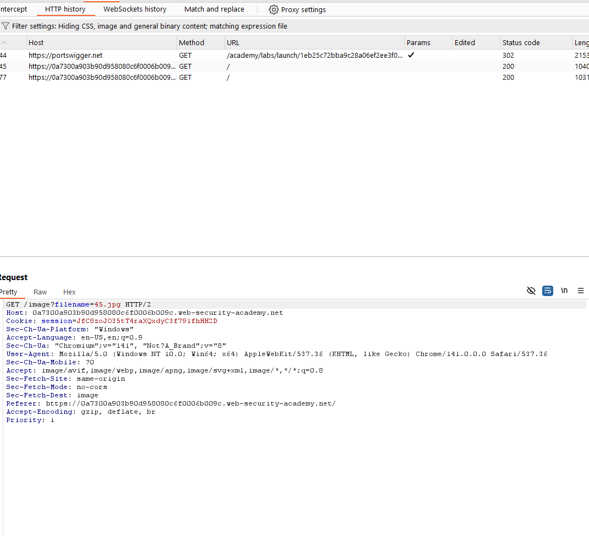
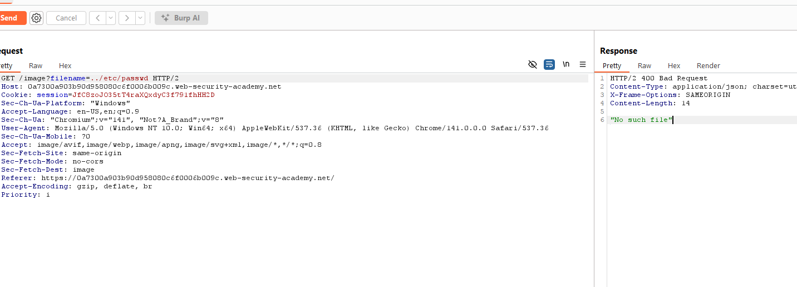
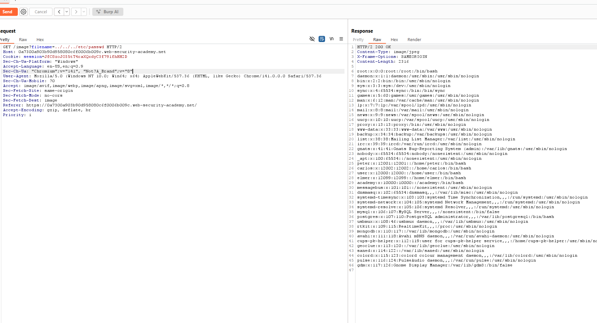
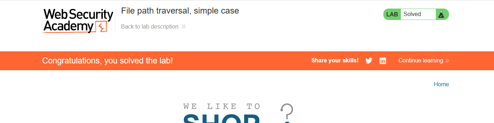

# Path traversal
*Lab: File path traversal, simple case*
## Tóm tắt 
- Tận dụng lỗ hổng đường dẫn tệp của web để truy cập các file hệ thống quan trọng 
## Khai thác
1. Dùng Burpsuite để lấy URL api load ảnh của web 

2. Tiến hành tăng cấp thư mục để tìm file etc/passwd

- tiếp tục tăng lên 2 đến 3 thì ta có được thư mục passwd

