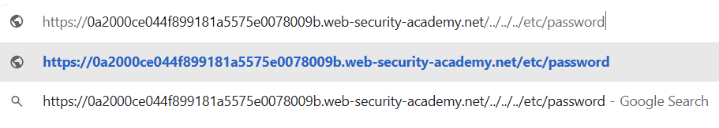
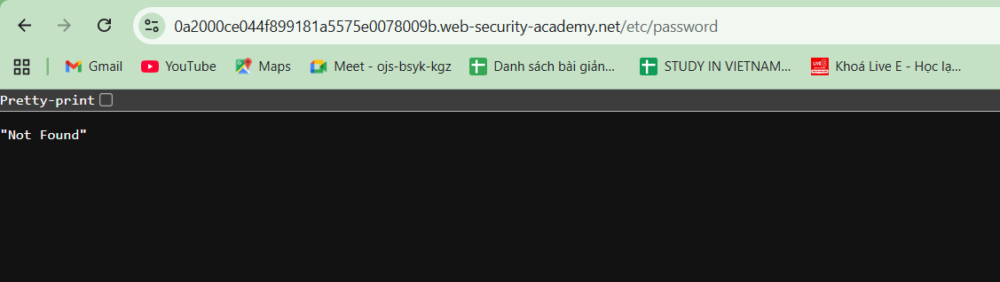
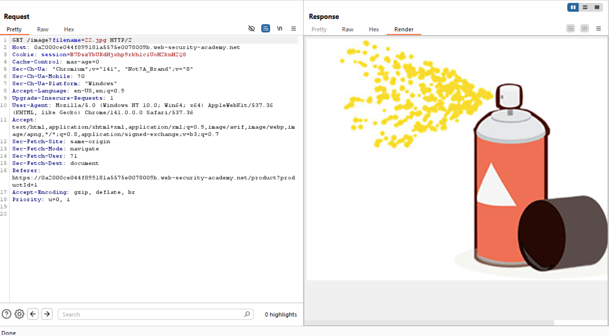
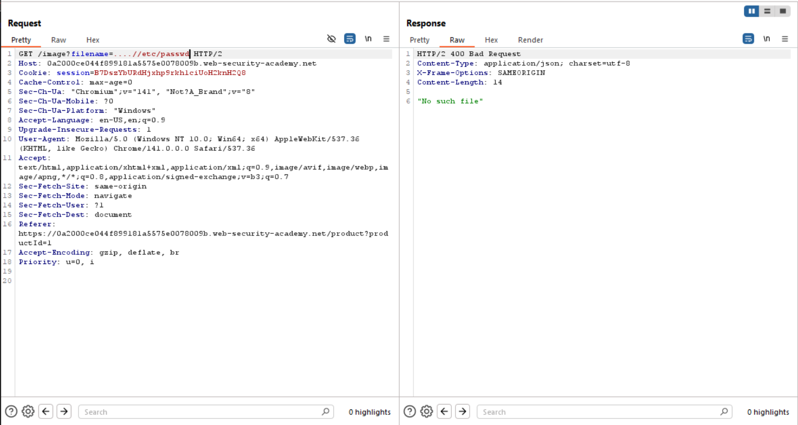
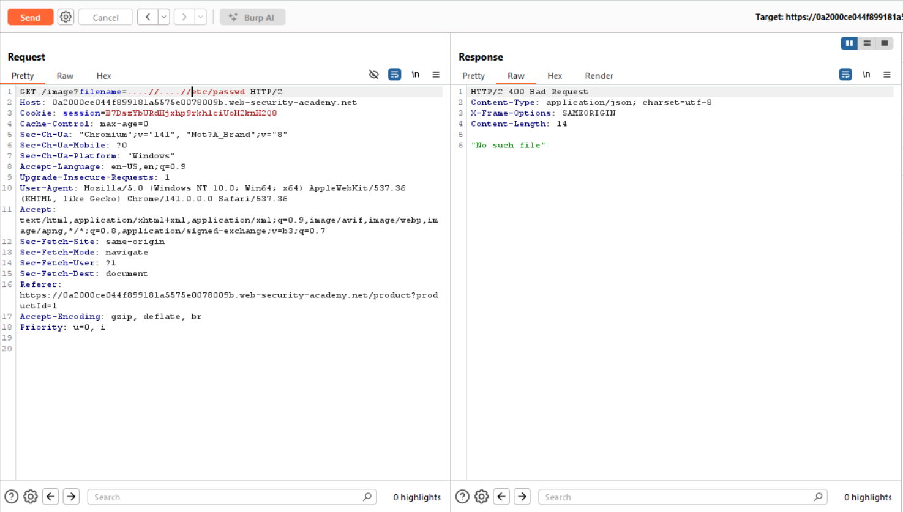
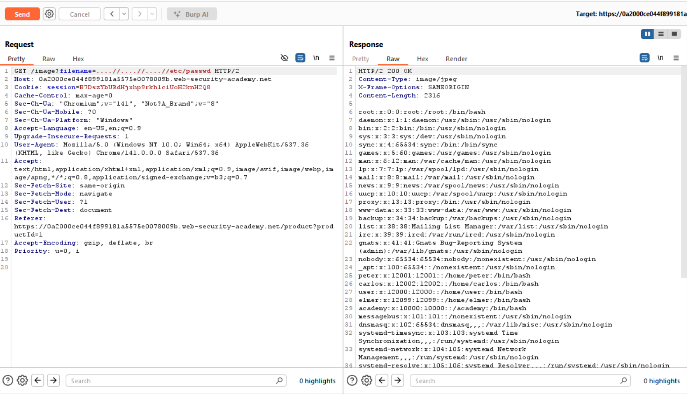
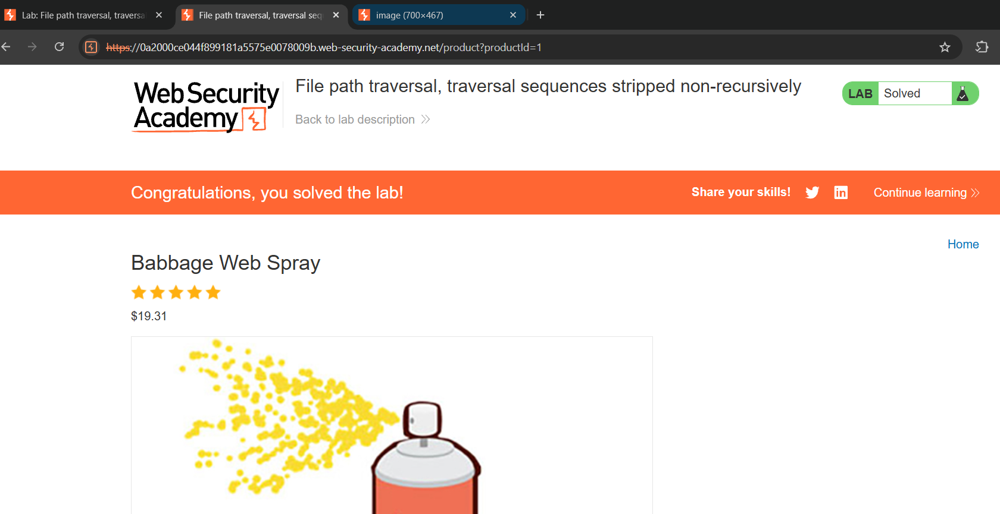

# Path traversal
*Lab: File path traversal, traversal sequences stripped non-recursively*
## Tóm tắt 
- Tận dụng lỗ hổng đường dẫn tệp của web để truy cập các file hệ thống quan trọng 
## Khai thác
1. Đánh giá 
- Khác với Lab2 sử dụng đường dẫn tuyệt đối để truy cập file hệ thống, Lab này sẽ xóa các kí tự "../" được người dùng nhập vào để di chuyển thư mục

2. Khai thác bằng Burp Suite
- Dùng Burp Suite để bắt request fetch ảnh sản phẩm

- Thay vì dùng "../" thông thường, ta sẽ sử dụng "....//" để di chuyển thư mục. Vì khi đó, chuỗi "../" trong "....//" sẽ bị detect và loại bỏ, còn lại đúng "../" để có thể di chuyển đến các thư mục khác
- Ta sửa filename để điều hướng tới file /etc/passwd bằng cách thêm từng chuỗi "....//" một để điều hướng chính xác tới đích

- Cuối cùng ta tìm được tới file /etc/passwd với payload hoàn chỉnh:
 ....//....//....//etc/passwd

 
