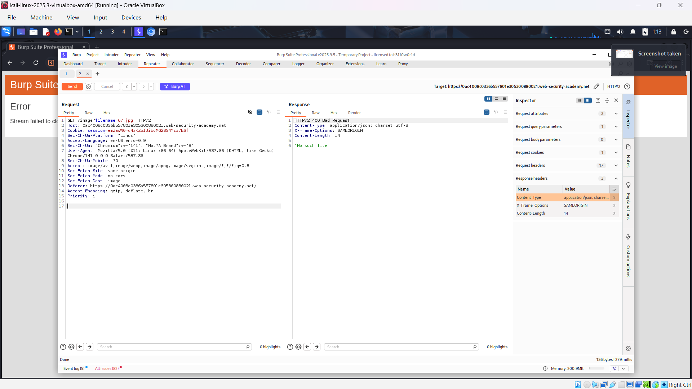
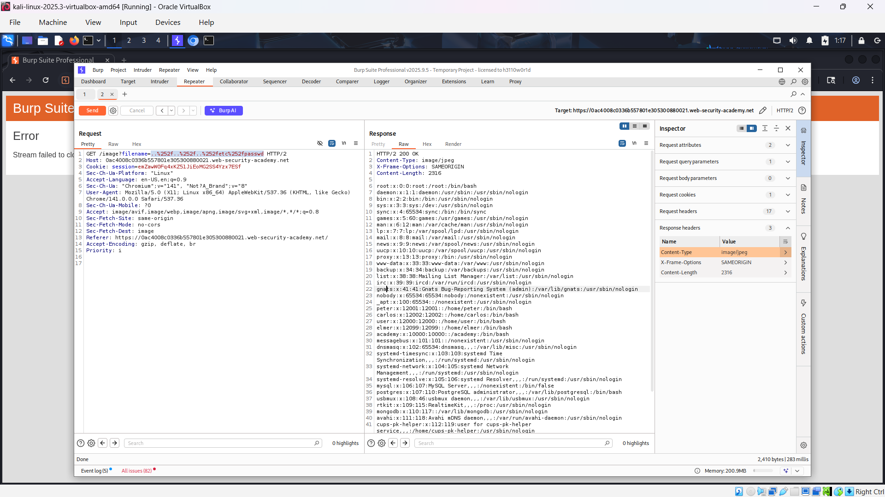
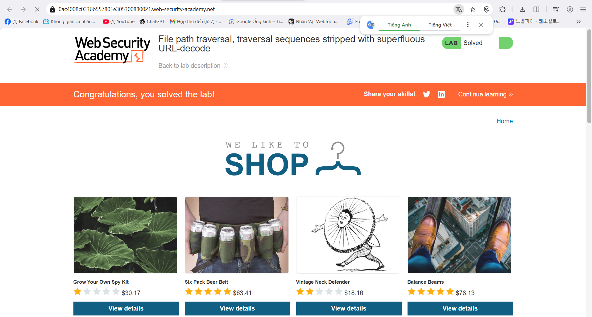

# Path traversal
*Lab: File path traversal, traversal sequences stripped with superfluous URL-decode*
## Tóm tắt 
- Tận dụng lỗi path traversal bằng cách mã hóa 2 lần URL để tránh phát hiện.
## Khai thác
1. Đánh giá 
- Sử dụng Burpsuite, truy cập trang web bắt 1 gói tin get chứa filename và thêm vào repeater.

2. Khai thác bằng Burp Suite
- Vì trang web đã lọc input ../ nhưng lại decode url sau khi đã kiểm tra nên ta encode path 2 lần.
- Thêm payload này vào filename: ..%252f..%252f..%252fetc%252fpasswd

