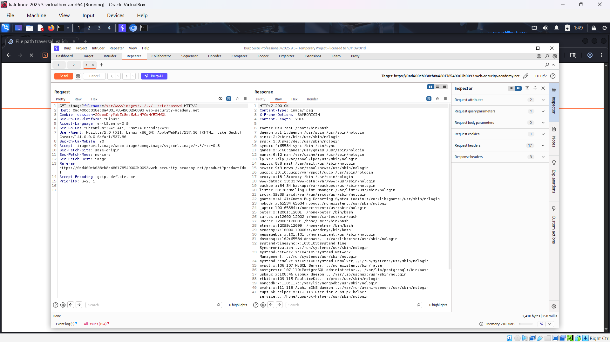

# Path traversal
*Lab: File path traversal, validation of start of path*
## Tóm tắt 
- Tận dụng lỗi path traversal qua đường dẫn đầy đủ.
## Khai thác
1. Đánh giá 
- Sử dụng Burpsuite, truy cập trang web bắt 1 gói tin get chứa filename và thêm vào repeater. Ta thấy nó chứa đường dẫn đầy đủ.

2. Khai thác bằng Burp Suite
- Ta dùng đường dẫn đầy đủ để đánh lừa hệ thống. Sau đó lùi file để về root, rồi trỏ tới etc/passwd.
- Dùng payload: /var/www/images/../../../etc/passwd

