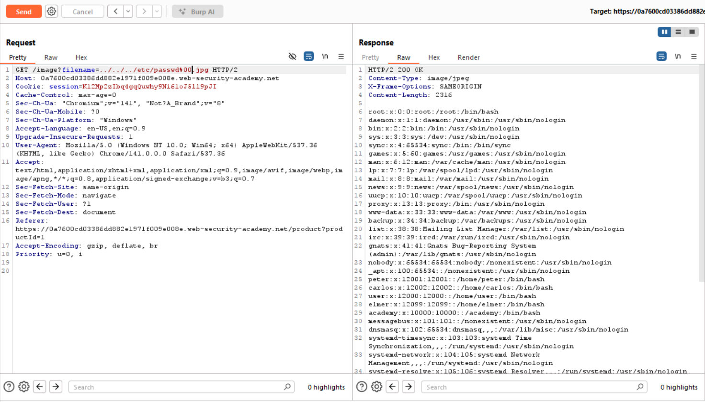
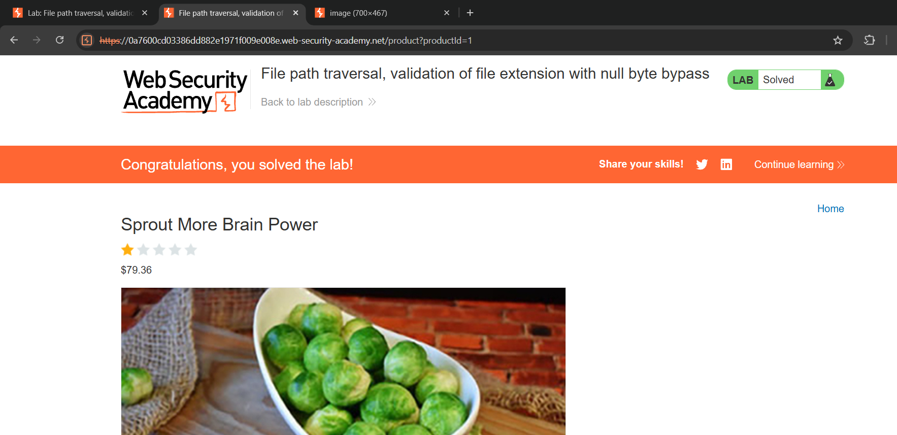

# Path traversal
*Lab: File path traversal, validation of file extension with null byte bypass*
## Tóm tắt 
- Tận dụng lỗ hổng đường dẫn tệp của web để truy cập các file hệ thống quan trọng 
## Khai thác
1. Đánh giá 
- Ở lab này, app có một cơ chế xác thực phần mở rộng tệp mong muốn. Trong bài này chỉ chấp nhận trả về các tệp có phần mở rộng .jpg, .png,...
- Khi app kiểm tra extension bằng thao tác chuỗi thông thường sẽ thấy có phần mở rộng phù hợp. Tuy nhiên khi path được truyền xuống module xử lý để trả response thì path sẽ tự động cắt khi gặp nullbyte (%00).
2. Khai thác bằng Burp Suite
- Dùng Burp Suite để bắt request fetch ảnh sản phẩm
- Tương tự các lab trước, file đích sẽ nằm ở ../../../etc/passwd. Tuy nhiên như đã phân tích ở phần 1, ta sẽ truyền vào payload với nullbyte để có thể bypass xác thực extension, cụ thể:
../../../etc/passwd%00.jpg
- Khi đó, app sẽ kiểm tra thấy có phần mở rộng phù hợp (jpg) và tiếp tục truyền path để tiếp tục xử lý, và khi response được trả, path thực sự là ../../../etc/passwd (cắt tại %00) nên ta lấy được thông tin của tệp /etc/passwd

 
