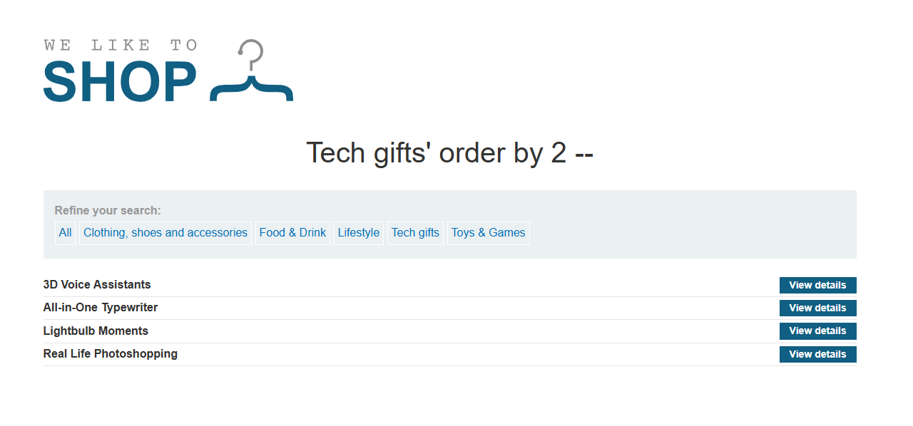
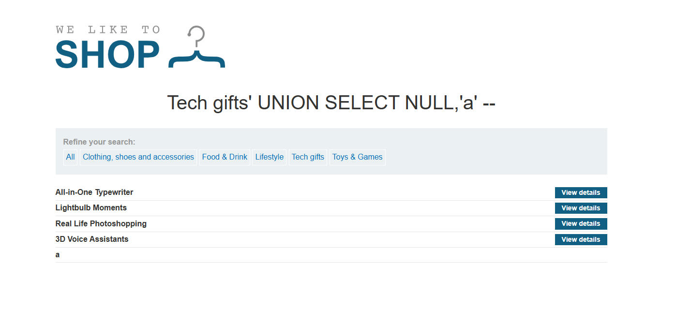
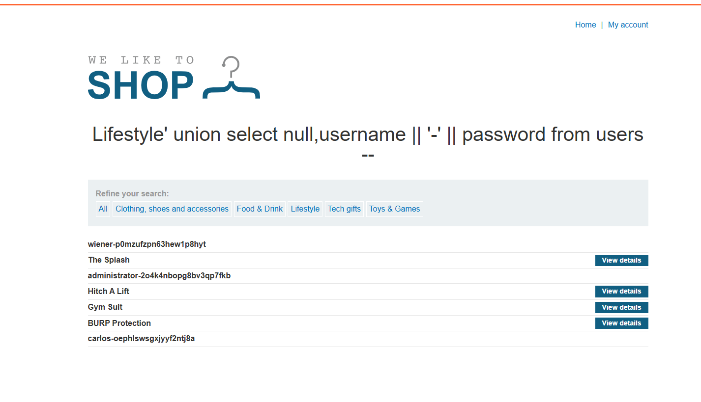
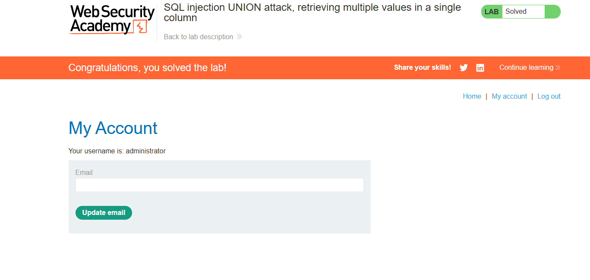

# WEB
*Lab: SQL injection UNION attack, retrieving multiple values in a single column*
## Tóm tắt
Tận dụng lỗ hổng SQL injection để login với quyền admin
## Khai thác 
1.**Tìm số cột và nơi hiển thị dữ liệu trả về của web**
- order by 3-- thì trang web lỗi, xuống 2 thì thành công => table có 2 cột 

- Sử dụng UNION SELECT 'a',NULL để tìm nơi hiển thị dữ liệu thì không có gì xảy ra, ta sửa lại thành NULL,'a' thì hiển thị a tại ô name của sản phẩm

2.**Lấy thông tin username và password từ bảng users**
- vì chỉ có một nơi để hiển thị dữ liệu nhưng dữ liệu ta cần lấy là 2 nên ta dùng phép nối chuõi trong sql 

3.**Login với quyền admin**

