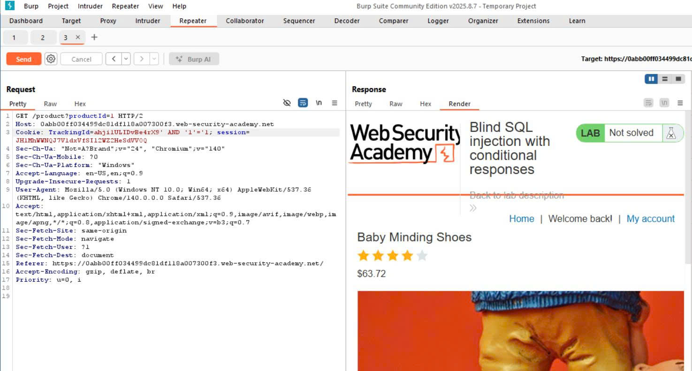
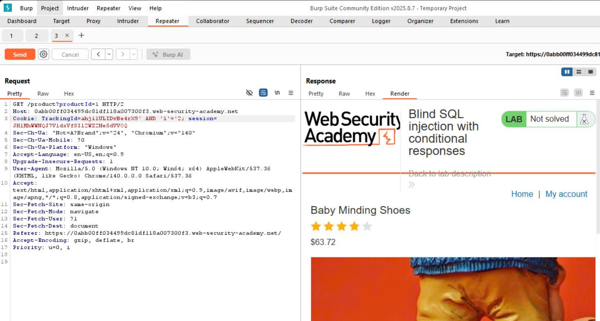
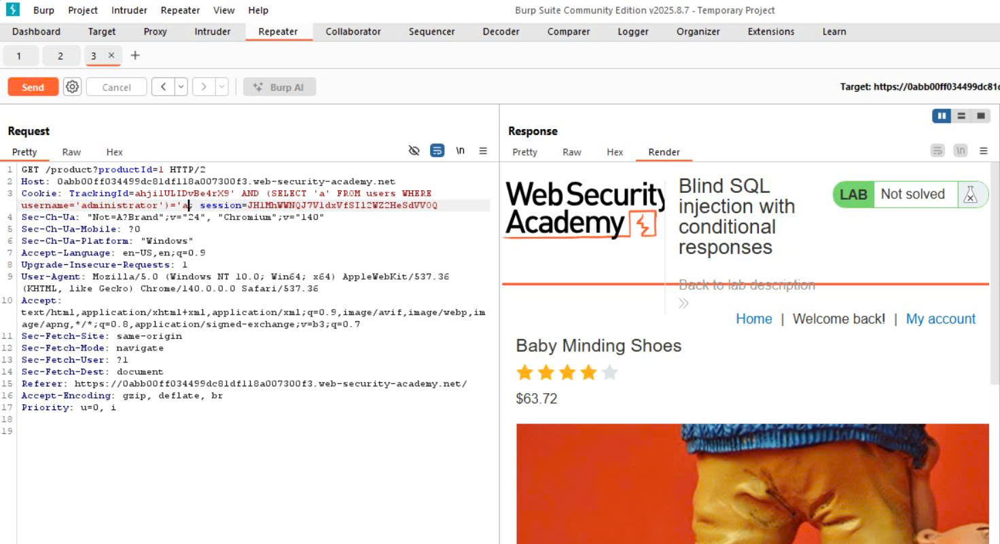
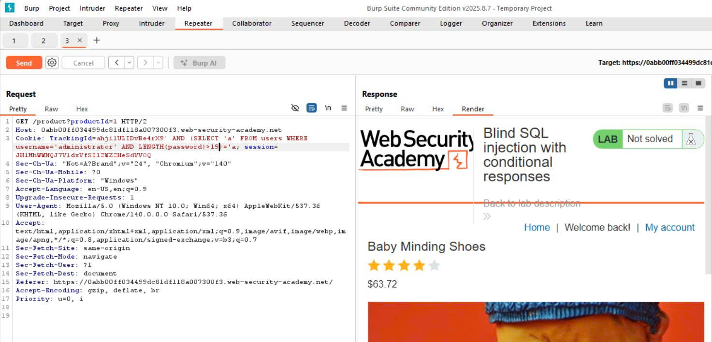
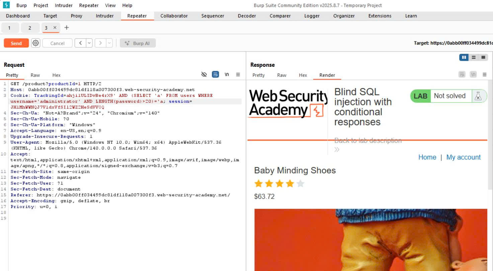
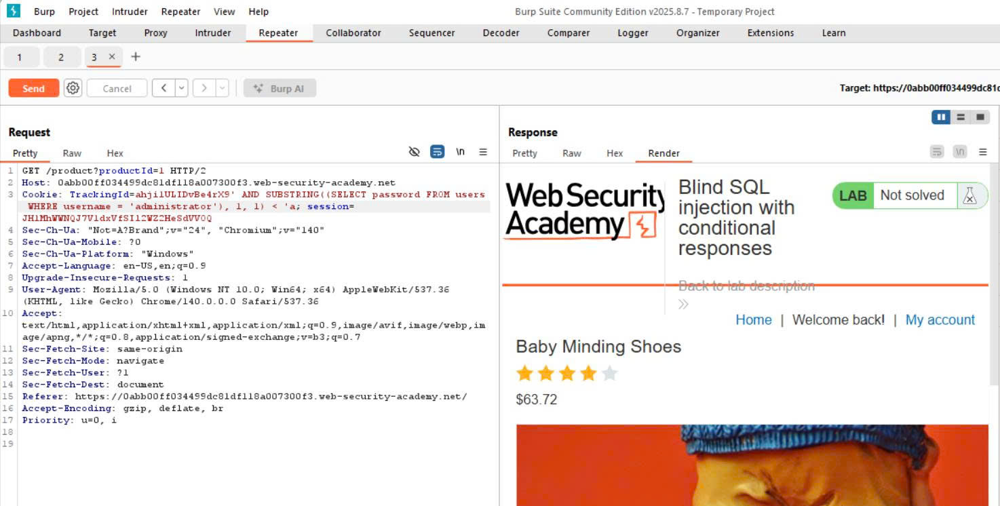
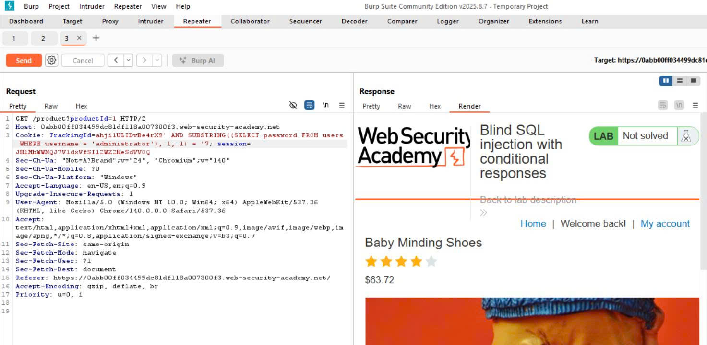
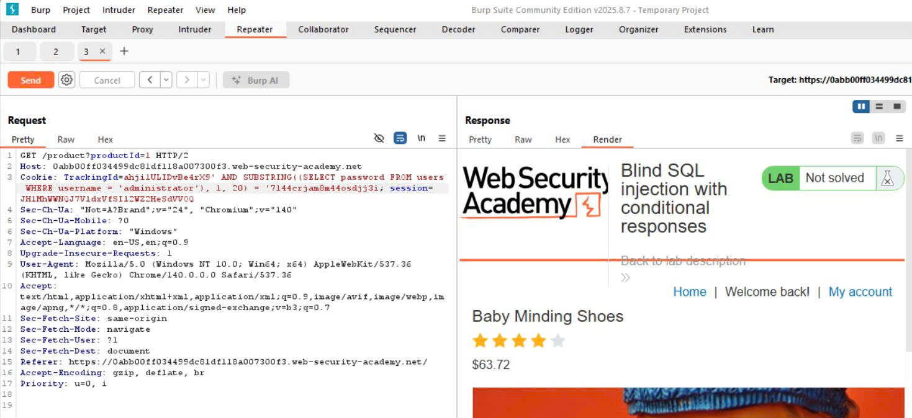
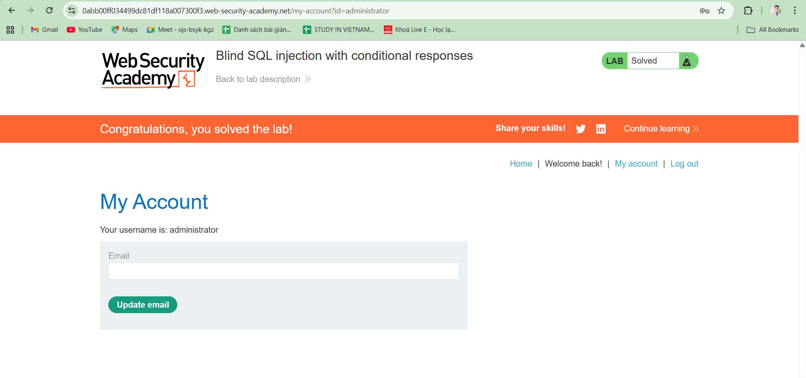

# WEB
*Lab: Blind SQL injection with conditional responses*
## Tóm tắt
- Challenge chứa lỗ hổng SQL injection. Ứng dụng sử dụng cookie theo dõi để phân tích và thực hiện truy vấn SQL chứa giá trị của cookie đã gửi. 
## Khai thác
1. **Xác nhận message "Welcome back!" được gửi khi truy vấn đúng (true)**
- Sửa TrackingID trong cookie, thêm 'AND '1'='1, nếu truy vấn đúng sẽ thấy message "Welcome back!"

- Nếu truy vấn sai, sẽ không có message 

2. **Xác nhận tồn tại username "administrator**
- Gửi truy vấn với phần thêm vào TrackingID: ' AND (SELECT 'a' FROM users WHERE username = 'administrator') = 'a

- Ta thấy có message, chứng tỏ truy vấn là đúng --> tồn tại username "administrator"
3. **Dò độ dài mật khẩu**
- Bằng cách liên tục gửi các truy vấn với phần thêm vào TrackingID: ' AND (SELECT 'a' FROM users WHERE username = 'administrator' AND LENGTH(password) > {x}) = 'a
Trong đó x là một số, nếu có message trả về chứng to LENGTH(password) lớn hơn x
- Hình dưới ta thấy LENGTH(password) > 19 là đúng

- Tiếp tục với x = 20, ta thấy truy vấn đã sai

- Vậy ta kết luận được độ dài password là 20 kí tự
4. **Dò độ kí tự ở từng vị trí, từ đó suy ra toàn bộ mật khẩu**
- Với ý tưởng tương tự như dò mật khẩu, ta sẽ gửi đi truy vấn để xem kí tự tại vị trí thứ i của password có lớn hơn kí tự được gửi đi hay không.
- Hình dưới ta thấy kí tự ở vị trí thứ 1 bé hơn kí tự 'a' là một truy vấn đúng, ta khẳng định kí tự đó là một số vì theo hint được cung cấp, ta có thể cho rằng mật khẩu chỉ bao gồm số và kí tự thường.

- Ta giảm dần ký tự gửi đi, khi giảm đến 8, ta vẫn thấy message trả về tuy nhiên khi đến 7 đã không còn thấy message nữa chứng tỏ lúc này truy vấn ... < '7 đã sai. Điều này đồng nghĩa kí tự đầu tiên của password chính là kí tự '7'. Kiểm tra lại với truy vấn = '7 thì thấy hoàn toàn chính xác (có message trả về)

- Tương tự với 19 vị trí còn lại của mật khẩu, ta dò được mật khẩu hoàn chỉnh. Hình dưới thực hiện truy vấn lấy tại vị trí đầu tiên của password 20 kí tự (đúng bằng độ dài password) đem so với các kí tự ta đã dò được ở từng vị trí thì hoàn toàn trùng khớp.

- Password: 7144crjam8m44osdjj3i
- Đăng nhập thành công

