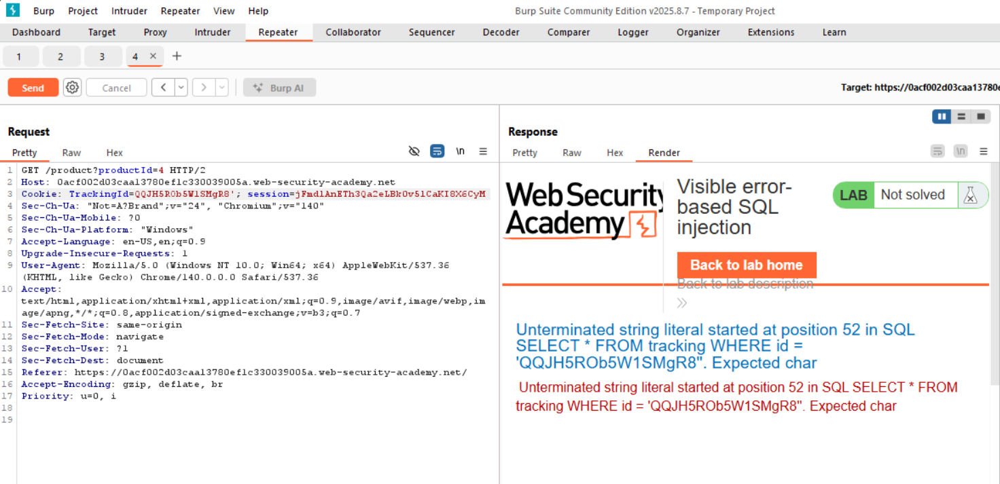
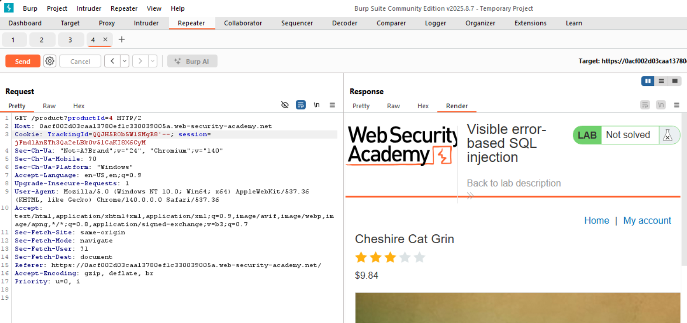
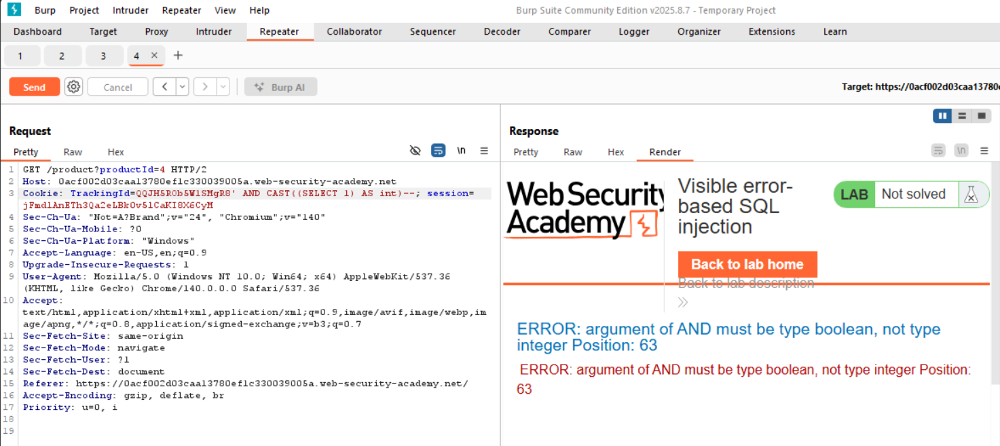
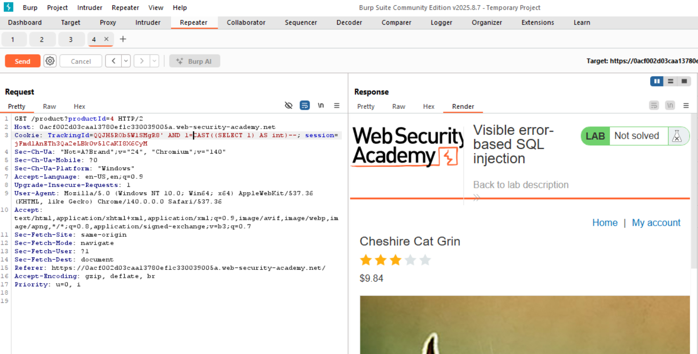
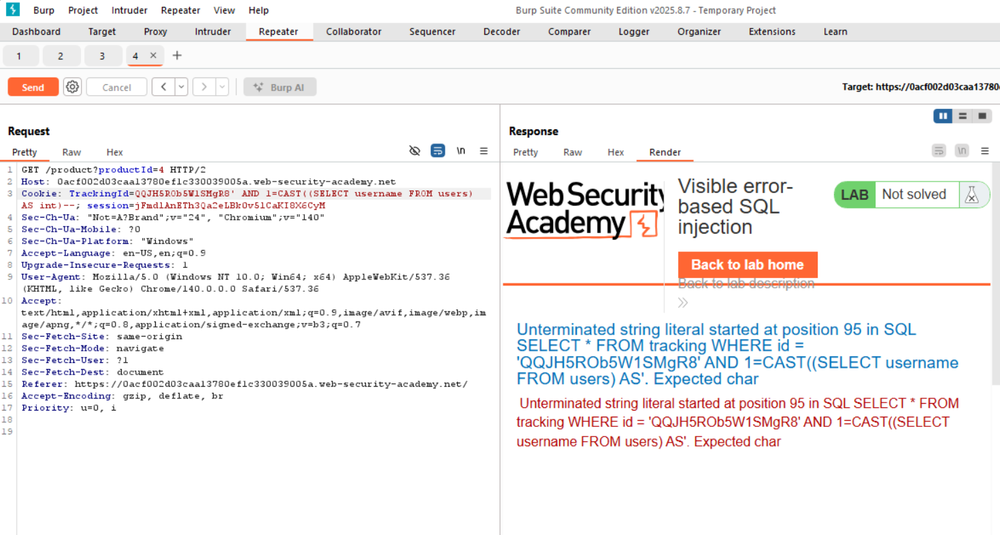
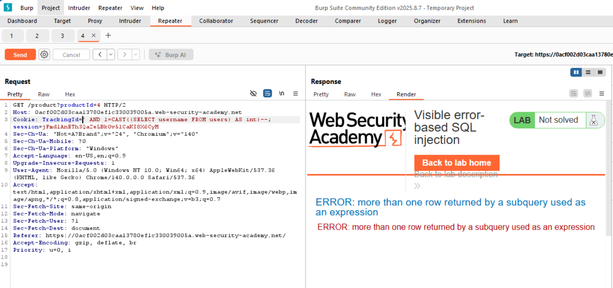
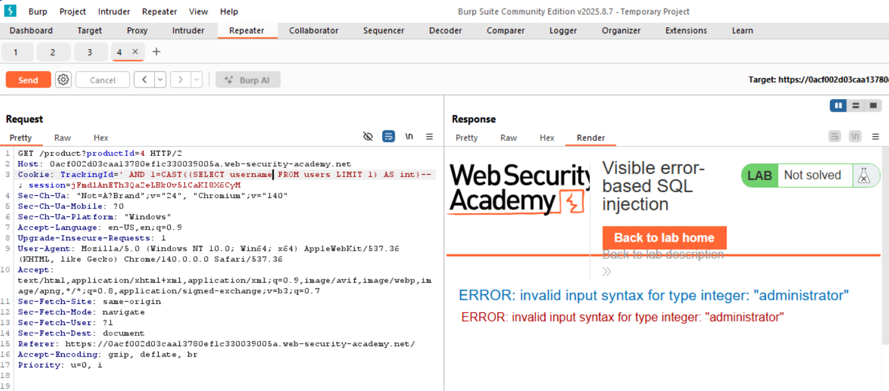
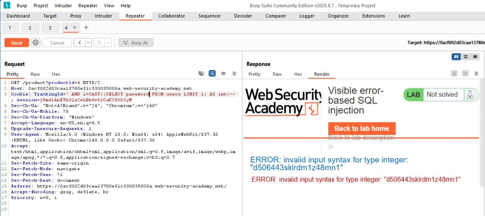
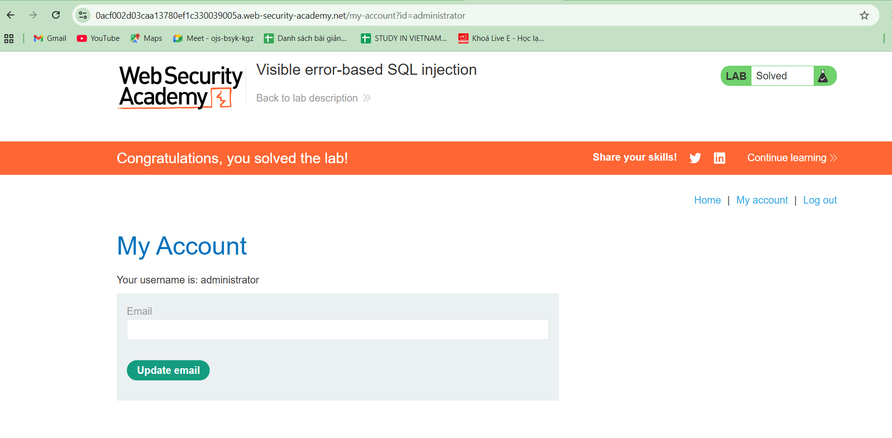

# WEB
*Lab: SQL injection vulnerability in WHERE clause allowing retrieval of hidden data*
## Tóm tắt
- Challenge này chứa lỗ hổng SQL injection. Ứng dụng sử dụng cookie theo dõi để phân tích và thực hiện truy vấn SQL chứa giá trị của cookie đã gửi. Kết quả của truy vấn SQL không được trả về. 
## Khai thác
- Mục tiêu là từng bước xây dựng được một truy vấn SQL để lấy được password của user administrator dựa vào errỏr log của server trả về
1. **Xây dựng cú pháp truy vấn hợp lệ**
- Dùng dấu nháy đơn ' để kiểm tra xem có lỗi truy vấn hay không, kết quả nhận được là một error log có nguyên câu truy vấn SQL mà server sử dụng, từ đó ta có thể xây dựng một câu truy vấn hợp lệ bằng cách thêm một "--" để comment dấu nháy đơn ' trong câu lệnh của server

2. **Cố gắng chèn một truy vấn con với SELECT để lấy ra thông tin từ bảng users**
- Dùng CAST để convert kết quả của subquery với select thành số nguyên (1 hoặc 0). Ta nhận được thông báo lỗi tham số của AND phải là kiểu boolean chứ không phải là int

- Thêm một phép so sánh với 1 sau AND để được câu truy vấn hợp lệ

3. **Bắt đầu khai thác username sử dụng subquery với SELECT**
- Sau khi đã xây dựng được một truy vấn hợp lệ với SELECT, ta tiến hành lấy thông tin username với subquery SELECT username FROM users
- Tuy nhiên, mặc dù cấu trúc của truy vấn là hợp lệ nhưng lúc này server vẫn trả lỗi, lý do là vì câu truy vấn gửi đi đã bị cắt mất một phần khi server thực thi truy vấn, dẫn đến truy vấn không hợp lệ

- Ta xóa luôn TrackingID để có thêm không gian cho truy vấn, để truy vấn gửi về server không bị cắt bớt và ta có truy vấn hợp lệ

- Tới đây đã không còn lỗi về truy vấn, nhưng ta lại thấy server trả về một lỗi khác, là kết quả trả về của truy vấn có nhiều hơn 1 dòng. Để khắc phục, ta thử giới hạn số dòng trả về là 1 với subquery SELECT username FROM users LIMIT 1

- Lúc này server trả về lỗi invalid input syntax for type integer: "administrator". Đơn giản là vì subquery đang cố cast "administrator" là một chuỗi thành 1 số nguyên và điều này là không hợp lệ. Tới đây ta đã biết dòng đầu tiên của bảng users chính là thông tin của administrator
4. **Lấy mật khẩu**
- Vì đã biết dòng đầu tiên (thứ 1) của bảng users là thông tin của admin, nên ta sửa lại subquery, thay vì lấy username thì ta lấy mật khẩu của administrator 

- Mật khẩu của administrator được log ra: d506443sklrdm1z48mn1
- Sử dụng mật khẩu và đăng nhập với tài khoản admin thành công

