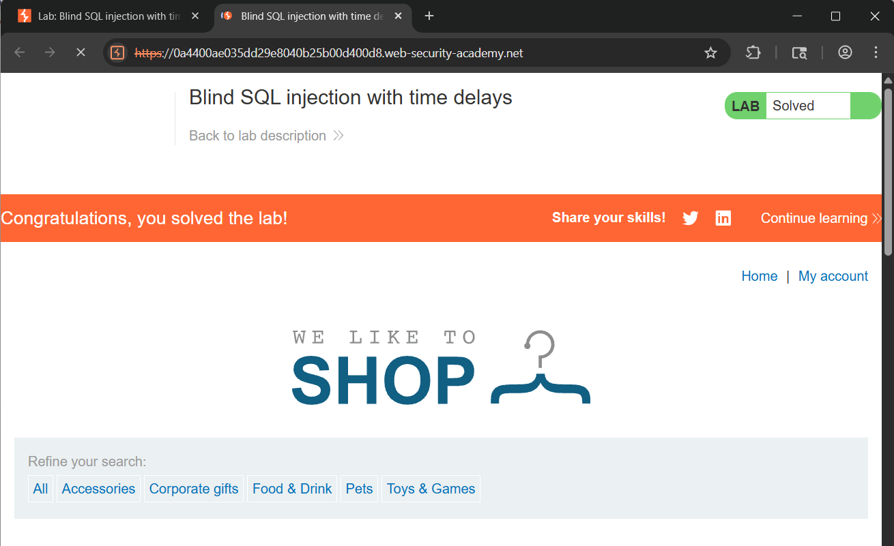

# WEB
*Lab: Blind SQL injection with time delays*
## Tóm tắt
- Ở challenge này kết quả của truy vấn SQL không được trả về, và ứng dụng không phản hồi khác nhau tùy thuộc vào việc truy vấn có trả về bất kỳ hàng nào hay gây ra lỗi hay không. Tuy nhiên, vì truy vấn được thực thi đồng bộ, nên có thể kích hoạt độ trễ thời gian có điều kiện để suy ra thông tin. 
## Khai thác
1. **Nối thêm một câu lệnh SQL để delay trang web phản hồi 10s**
- Sửa TrackingID: ' || SELECT pg_sleep(10)--
