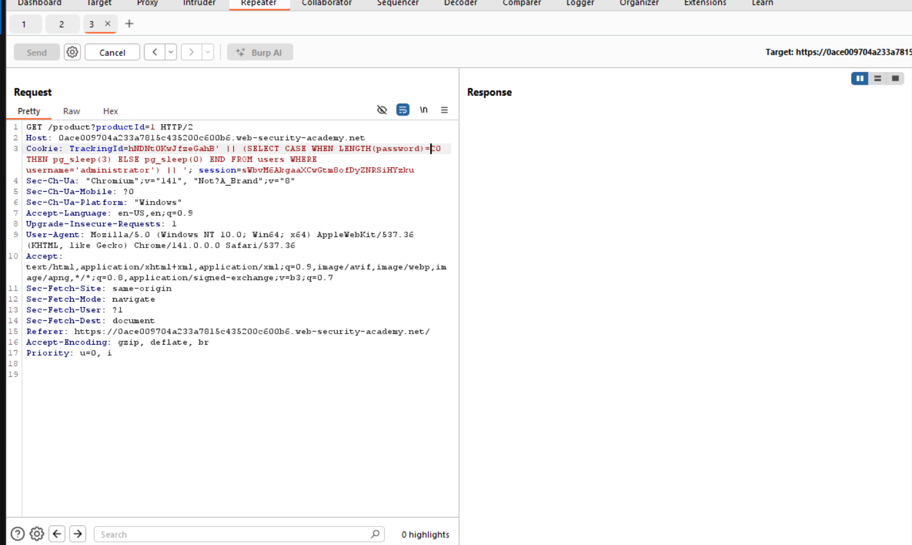
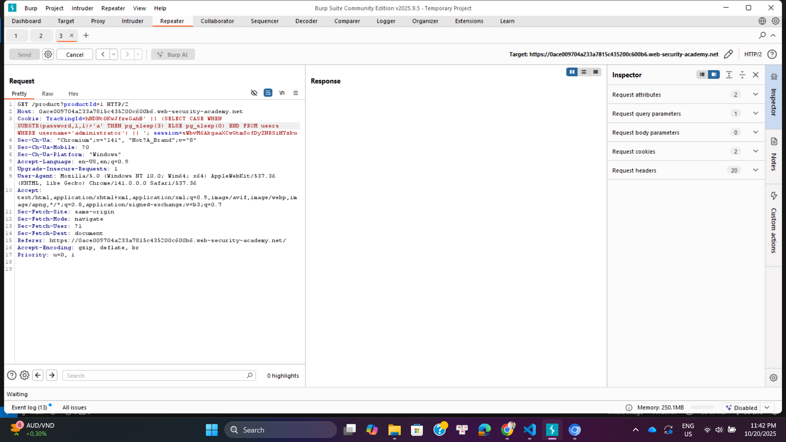
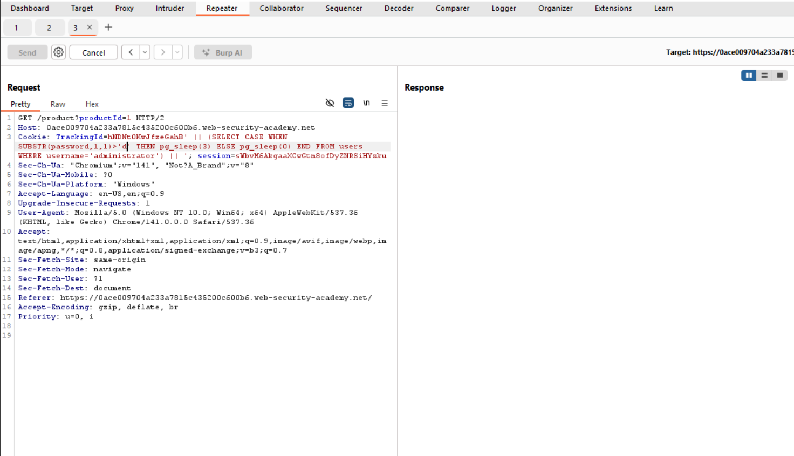
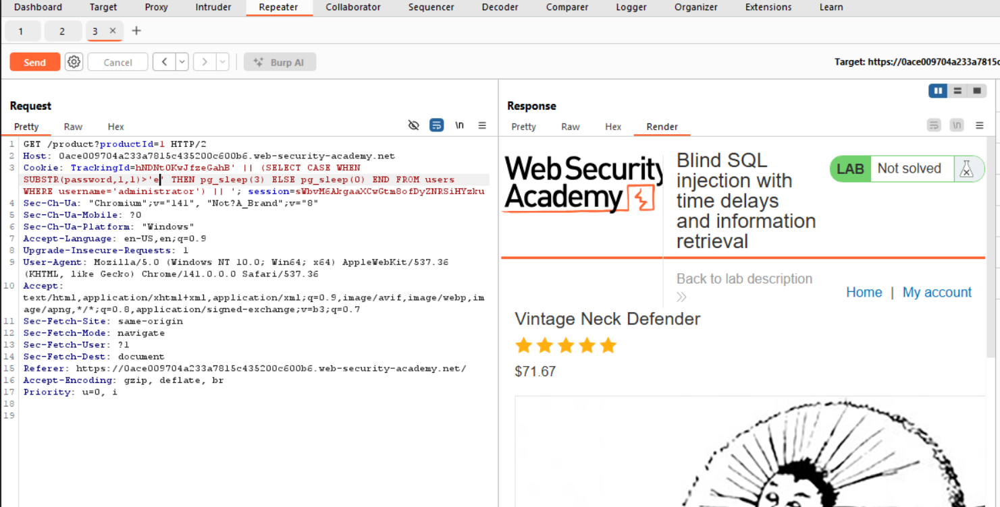
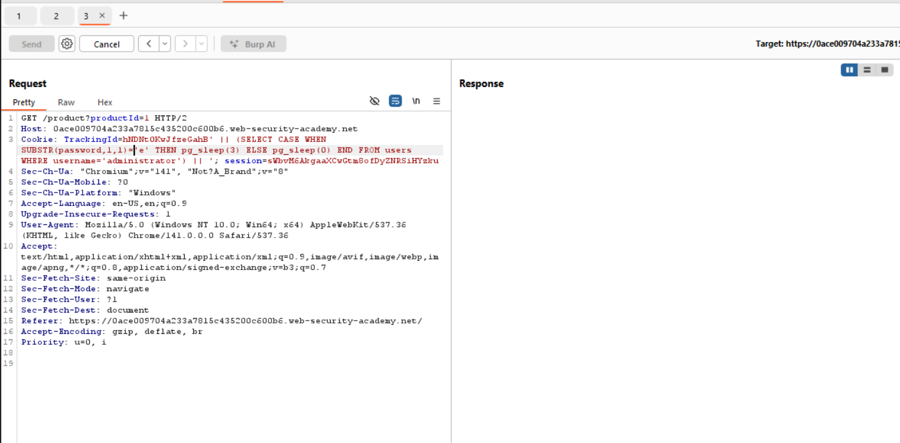
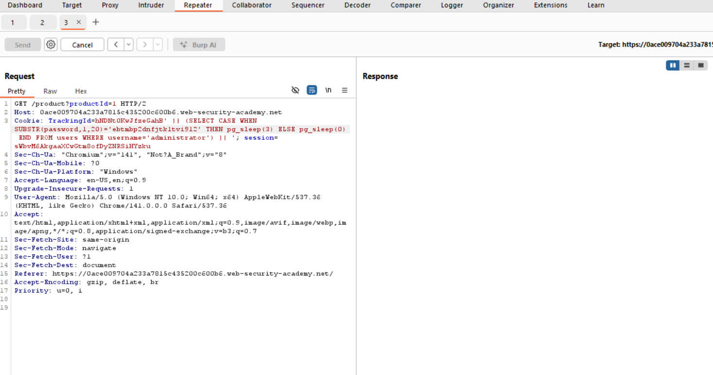
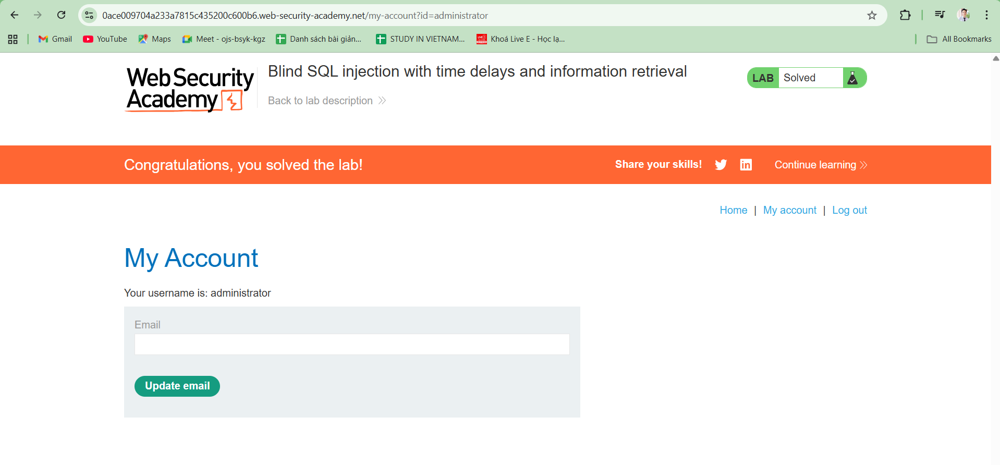

# WEB
*Lab: Blind SQL injection with time delays and information retrieval*
## Tóm tắt
- Tương tự như Lab 11 và 12, tuy nhiên ở challenge này, thay vì dựa vào message hay thông báo lỗi mà ứng dụng trả về, ta dựa vào thời gian phản hồi có điều kiện đề truy xuất thông tin của user administrator
## Khai thác
1. **Dò độ dài mật khẩu**
- Mô tả bài Lab đã chỉ rõ trong database chứa table users với các trường username và password, để truy xuất thông tin của administrator ta cần một truy vấn để ứng dụng delay với điều kiện được gửi đi
- Bằng cách liên tục gửi query với phần thêm vào TrackingID: '||(SELECT CASE WHEN LENGTH(password)>{x} THEN pg_sleep(3) ELSE pg_sleep(0) END FROM users WHERE username='administrator')||'
Trong đó x là một số, nếu có thông báo lỗi trả về chứng tỏ LENGTH(password) lớn hơn x
- Tương tự các lab trước, ta thấy LENGTH(password) > 19 là đúng (delay 3s)
- Tiếp tục với x = 20, ta thấy truy vấn đã sai (không delay)
- Kiểm tra lại với truy vấn ...LENGTH(password)=20, kết quả truy vấn là đúng (delay 3s)

- Vậy ta kết luận được độ dài password là 20 kí tự
2. **Dò độ kí tự ở từng vị trí, từ đó suy ra toàn bộ mật khẩu**
- Với ý tưởng tương tự như dò độ dài mật khẩu, ta sẽ gửi đi truy vấn để xem kí tự tại vị trí thứ i của password có lớn hơn kí tự được gửi đi hay không.
- Hình dưới ta thấy kí tự ở vị trí thứ 1 lớn hơn kí tự 'a' là một truy vấn đúng, (cho rằng mật khẩu chỉ bao gồm số và kí tự thường).

- Ta tăng dần ký tự gửi đi (có thể dùng thuật toán binary search để tối ưu thời gian thử các giá trị), khi thử đến d, ta vẫn thấy ứng dụng delay 3s (truy vấn đúng)

- Tuy nhiên khi đến e đã không còn delay nữa chứng tỏ lúc này truy vấn ... SUBSTR(password, 1, 1)>'e'... đã sai. 

- Điều này đồng nghĩa kí tự đầu tiên của password chính là kí tự 'e'. Kiểm tra lại với truy vấn ...SUBSTR(password, 1, 1)='e' thì thấy hoàn toàn chính xác (có thông báo lỗi trả về)

- Thực hiện tương tự với 19 vị trí còn lại của mật khẩu, ta dò được mật khẩu hoàn chỉnh. Hình dưới thực hiện truy vấn lấy tại vị trí đầu tiên của password 20 kí tự (đúng bằng độ dài password) đem so với các kí tự ta đã dò được ở từng vị trí thì hoàn toàn trùng khớp.

- Password: ebtmbp2dnfjtk1tvi912
- Đăng nhập thành công

