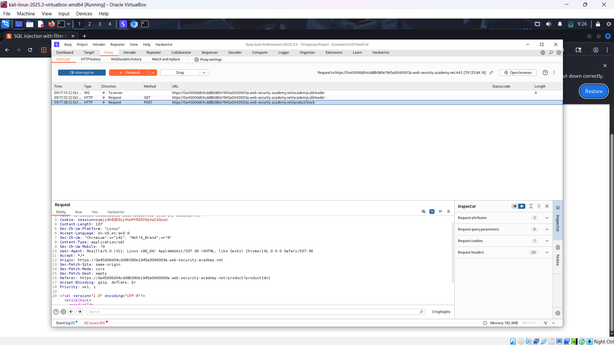
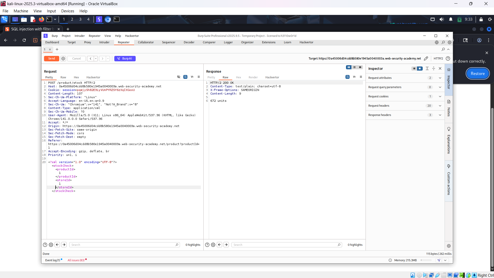
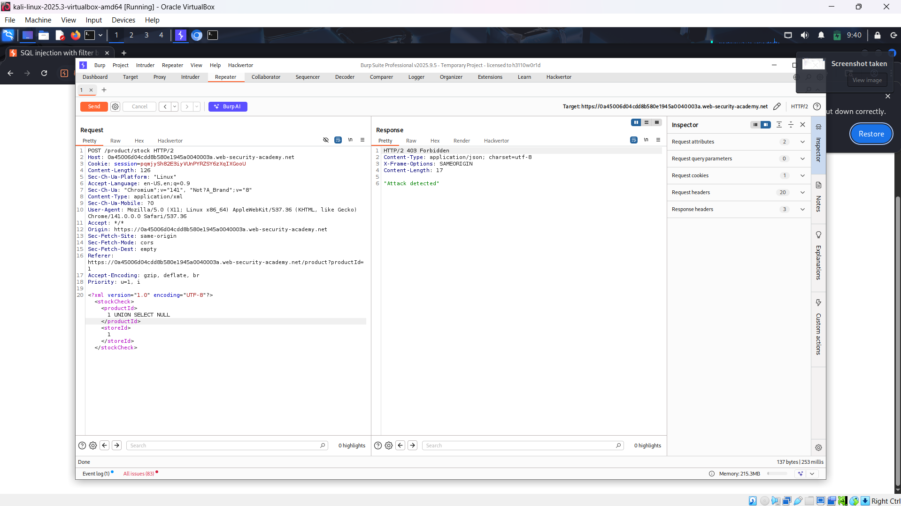
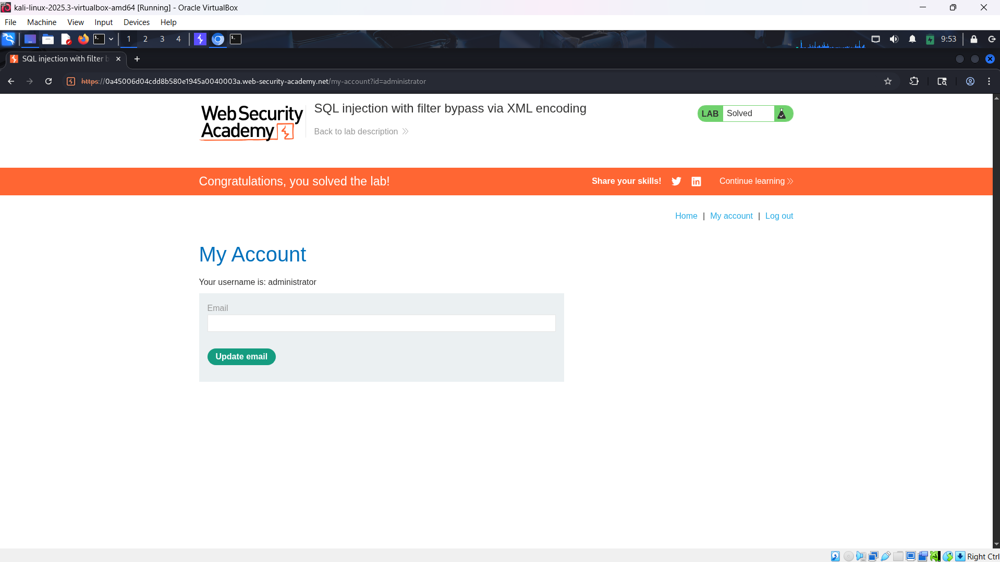

# WEB

*Lab: SQL injection with filter bypass via XML encoding*

## Tóm tắt

Thực hiện tấn công SQL Injection nhưng trang web có WAF. Cần phải đưa payload về dạng ít có dấu hiệu của 1 cuộc tấn công để vượt qua và tiến hành khai thác.
## Khai thác

1. Vào chi tiết 1 sản phẩm bất kì, bấm vào check stock và bắt gói tin POST lại và thêm vào repeater.

2. Tại phần xml, sửa productId hoặc storeId để xem có trả về gì không.

-Nhận thấy khi sửa productId thì units thay đổi, chứng tỏ có ảnh hưởng.
3. Thử kiểm tra số cột của bảng bằng UNION SELECT
 
-Nhận ra vấn đề: Có cảnh báo phát hiện tấn công.
-Phải làm cho payload khó phát hiện tấn công hơn.
4. Sử dụng extension hackvertor của burpsuite.
- Highlight đoạn payload thêm vào, chuột phải-> vào extension và chọn hex_entitis
- Vì ở phần productId ra kết quả 0-> có lỗi, nhưng cũng không phát hiện-> có tác dụng, chuyển sang storeId, từ 2 NULL thì có lỗi -> 1 cột.

5. Vì chỉ có 1 cột, ta phải lấy cả username và password cùng 1 lúc. Sử dụng ||'~'|| để nối chúng lại.

- Sử dụng tài khoản lấy được để đăng nhập và hoàn thành bài lab.

