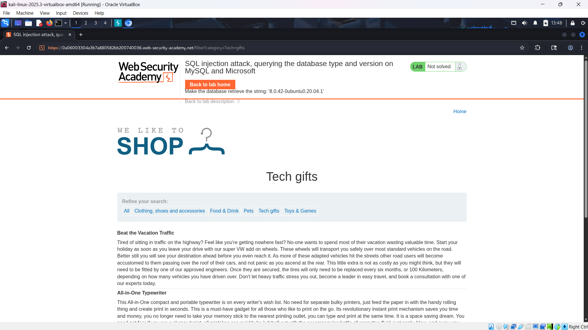
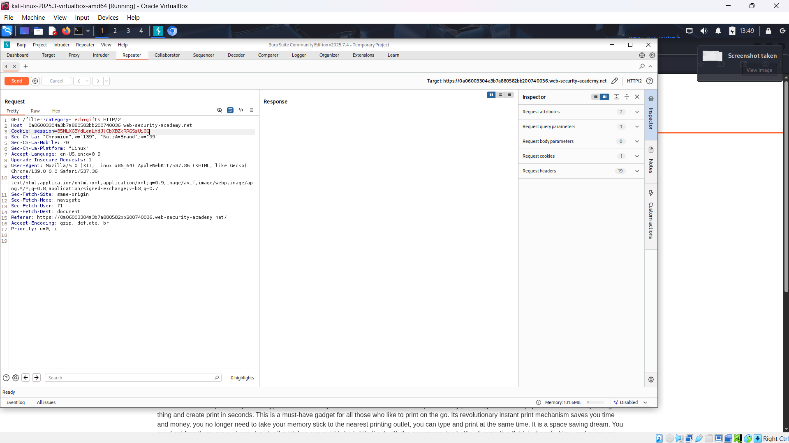

# WEB

*Lab: SQL injection attack, querying the database type and version on MySQL and Microsoft*

## Tóm tắt

Khai thác lỗ hổng SQL injection trong bộ lọc danh mục sản phẩm để truy vấn phiên bản CSDL (database version) trên hệ quản trị MySQL hoặc Microsoft SQL Server, thông qua kỹ thuật UNION SELECT.
## Khai thác

1. Truy cập trang web và chọn một danh mục, ở đây chọn “Tech gifts”. Trang hiển thị danh sách sản phẩm.

2. Chặn request bằng Burp Suite, gửi sang Repeater. Payload injection nằm ở parameter `category`.

3. Xác định số lượng cột trả về bằng cách thử `'UNION SELECT NULL,...#` cho đến khi thành công (không báo lỗi).  Ở đây khi có 2 NULL thì server báo 200 OK =>có 2 cột

4. Xác định cột chứa text.
- Dùng lệnh 'UNION SELECT 'abc','def'# để xác định cột hiển thị text.
 
5. Truy vấn phiên bản database.
- Sử dụng biến hệ thống hệ thống `@@version`.
- Câu lệnh "'UNION SELECT @@version,NULL#".

