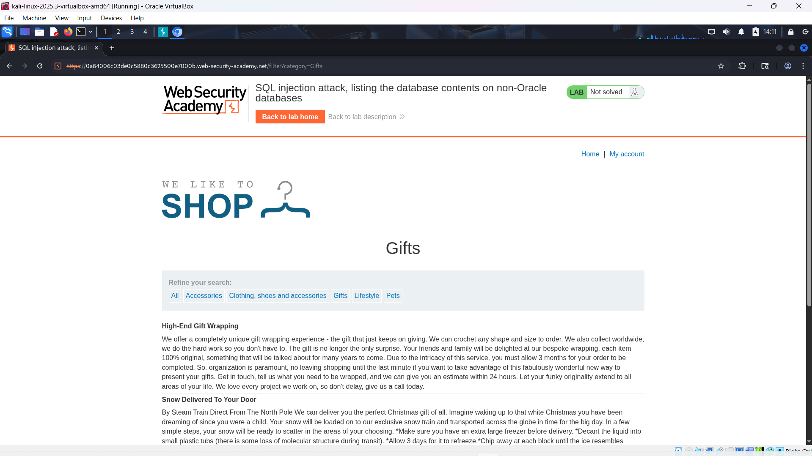
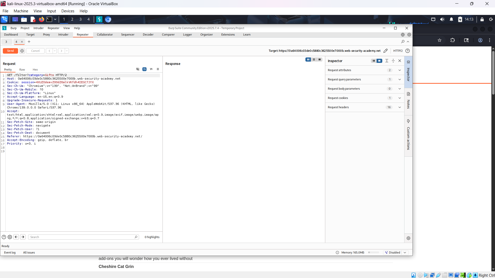
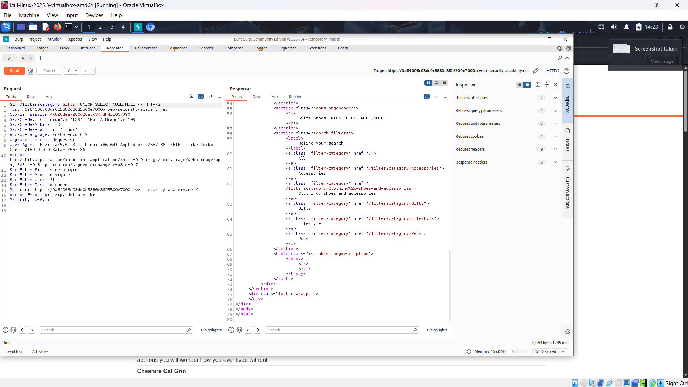
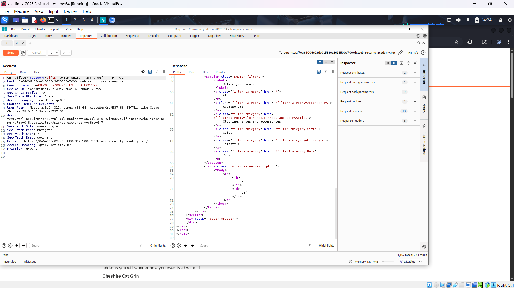
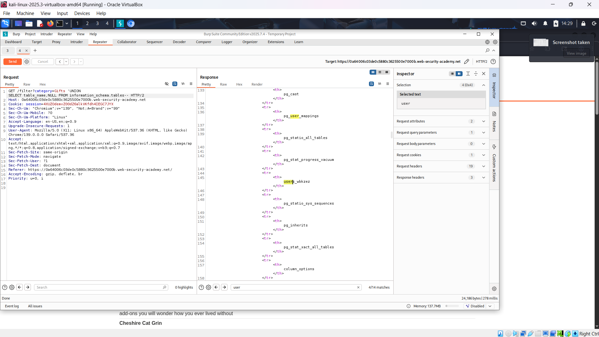
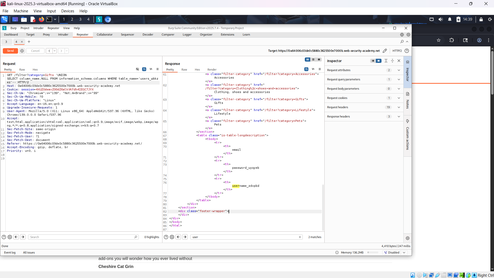
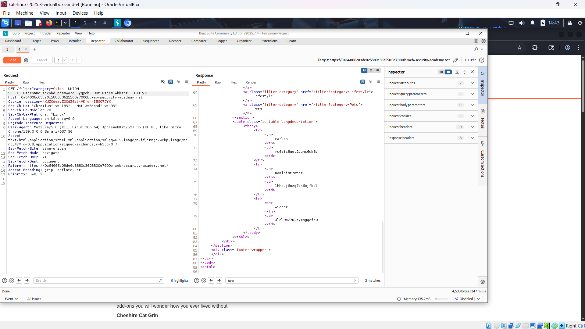
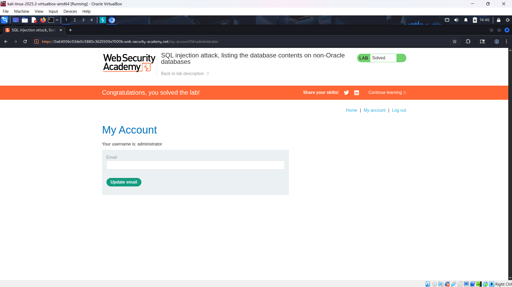

# WEB

*Lab: SQL injection attack, listing the database contents on non-Oracle databases*

## Tóm tắt

Khai thác lỗ hổng SQL injection trong bộ lọc danh mục sản phẩm để liệt kê toàn bộ cấu trúc CSDL (tên bảng, tên cột) và trích xuất thông tin tài khoản đăng nhập, cụ thể là username/password của admin, nhằm đăng nhập và hoàn thành lab.
## Khai thác

1. Truy cập trang web và chọn một danh mục, ở đây chọn “Gifts”.

2. Chặn request bằng Burp Suite, gửi sang Repeater. Payload injection nằm ở parameter `category`.

3. Xác định số lượng cột trả về bằng cách thử `'UNION SELECT NULL,...` cho đến khi thành công (không báo lỗi).  Ở đây khi có 2 NULL thì server báo 200 OK =>có 2 cột

4. Xác định cột chứa text.
- Dùng lệnh 'UNION SELECT 'abc','def' -- để xác định cột hiển thị text.
 
5. Liệt kê tên các bảng trong database 
- Sử dụng bảng hệ thống chứa danh sách bảng information_schema.tables.
- Câu lệnh 'UNION SELECT table_name,NULL FROM information_schema.tables-- để trích xuất tên bảng.
- Tìm bảng có tên người dùng. Ở đây là bảng users_wbkzez.

6. Liệt kê các tên cột của bảng user_wbkzez.
- Dùng lệnh'UNION SELECT column_name,NULL FROM information_schema.columns WHERE table_name='users_wbkzez'--

- Các cột password, user lần lượt là: password_uyqyeb, username_zdvpbd.
7. Trích xuất dữ liệu đăng nhập
- Dùng lệnh 'UNION SELECT username_zdvpbd,password_uyqyeb FROM users_wbkzez--

- Tìm được tài khoản admin: administrator: 1hhquj6nzg7tk6ojfbel
8. Đăng nhập bằng tài khoản admin để hoàn thành lab

