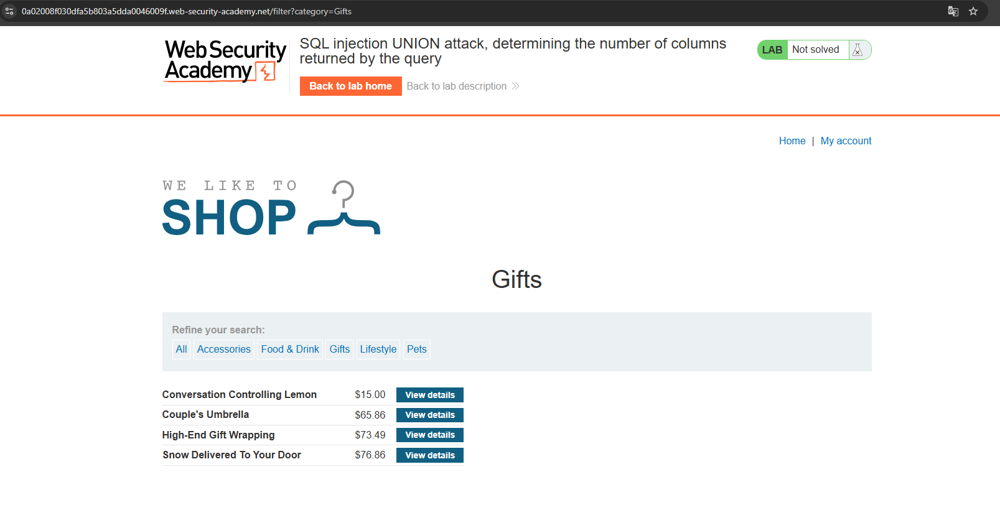

# WEB 
*Lab: SQL injection UNION attack, determining the number of columns returned by the query*
## Tóm tắt
Tận dụng lỗ hổng SQL injection trong bộ lọc danh mục của sản phẩm để xác định số lượng cột mà truy vấn trả về 
## Khai thác
1. Truy cập trang web và chọn danh mục Gifts, trang web trả về số lượng sản phẩm 

2. Sử dụng order by + UNION select NULL... để truy xuất số lượng cột mà truy vấn trả về 
- Thử với order by =5 thì trang web trả về lỗi 

- Giảm xuống còn 3 thì truy vấn thành công vậy số lượng cột mà truy vấn trả về là 3

- UNION slect NULL,NULL,NULL -- 

