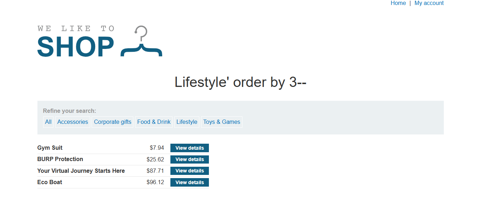
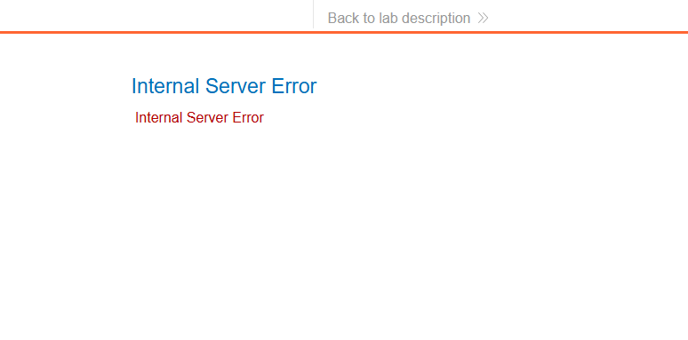
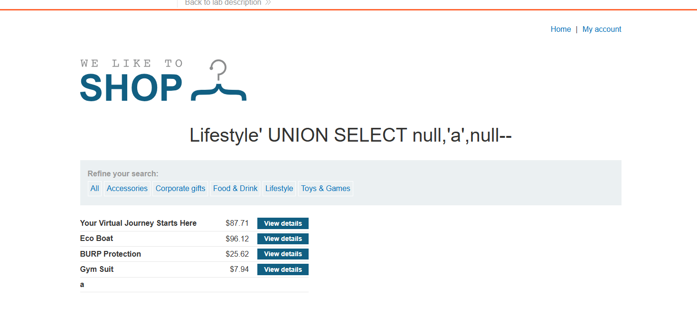
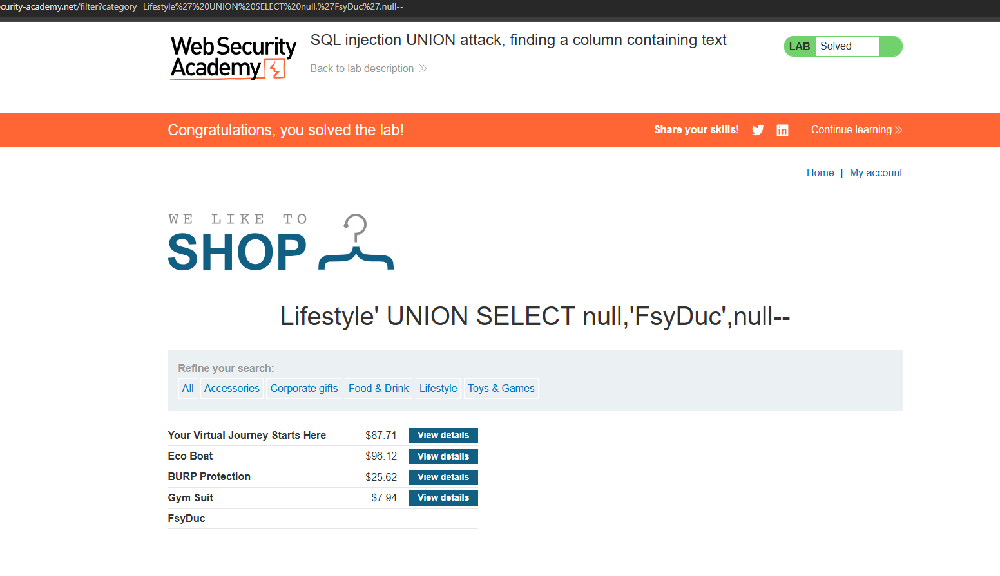

# WEB
*Lab: SQL injection UNION attack, finding a column containing text*
## Tóm tắt
Sử dụng UNION kết hợp với sql injection để leak nơi hiển thị dữ liệu 
## Khai thác
1. Như bài trướtrướ(LAB7) thì đã biết table này có 3 cột thông qua order by 3

2. Tiếp tục sử dụng UNION trong sql server để leak nơi hiển thị ra dữ liệu dạng text bằng lênh "UNION SELECT 'a',NULL,NULL" nhưng trang web báo lỗi 

3. tiếp tục thử với UNION SELECT NULL,'a',NULL trang web trả về cột đầu tiên là nơi hiển thị dữ liệu 

4. sửa lại text cho giống yêu cầu của lab 

