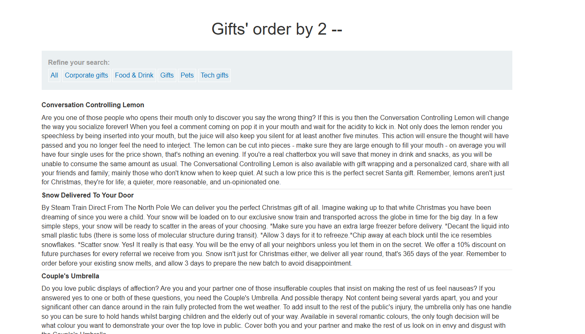
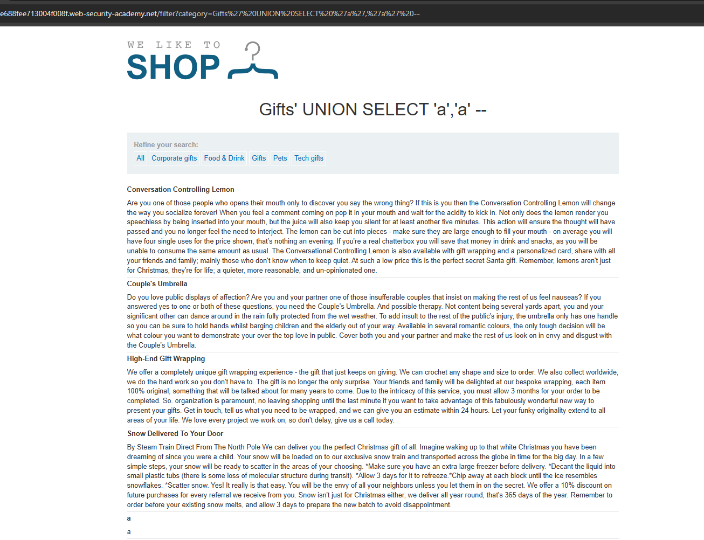
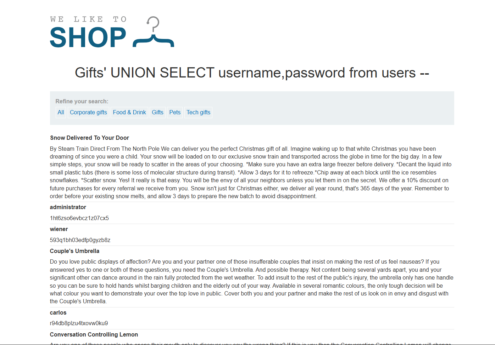
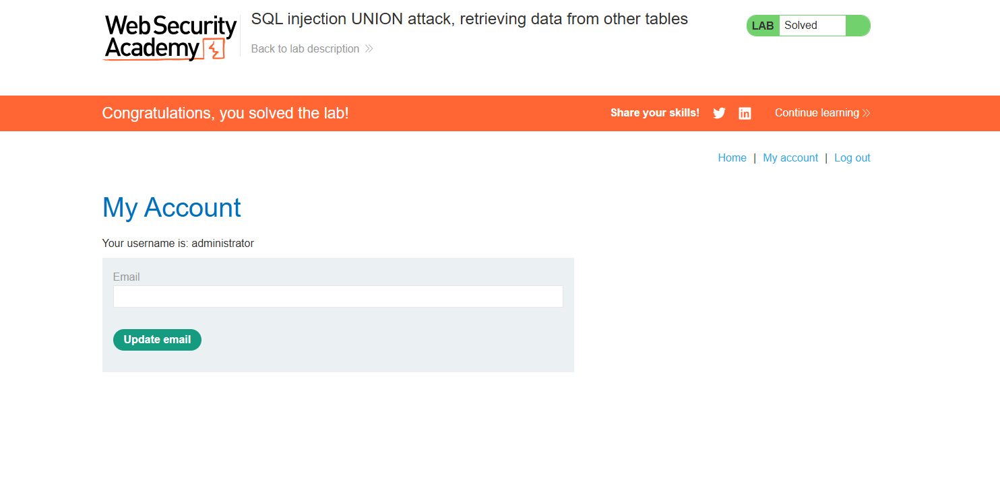

# WEB
*Lab: SQL injection UNION attack, retrieving data from other tables*
## Tóm tắt
Tận dụng lỗ hổng SQL injection của chall và lấy thông tin login của admin 
## Khai thác
1. **Tìm số lượng cột mà web trả về** 
- order by 5-- web bị lỗi, giảm xuống còn 2 thì hết lỗi 

2. **Tìm nơi hiển thị dữ liệu** 
- UNION SELECT 'a','a' -- 
- Web trả về cả 2 cột đều được hiển thị dữ liệu 

3. **Lấy thông tin của admin**
- Theo đề bài thì có 1 bảng users có thông tin của username và password 
- UNION SELECT username,password from users --
- Sử dụng lệnh trên để truy vấn username và password có trong bảng users ta lấy được thông tin của admin

- Tiến hành login thành công với quyền admin 

